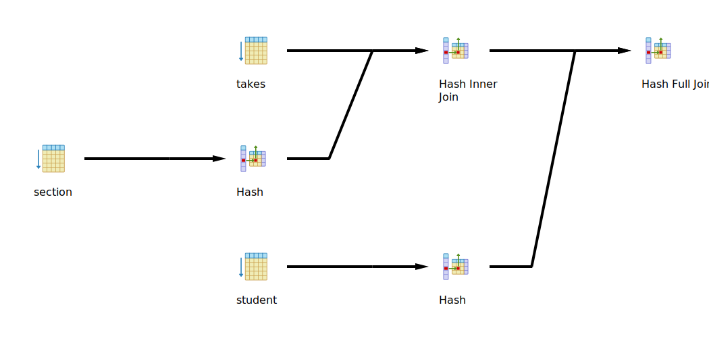
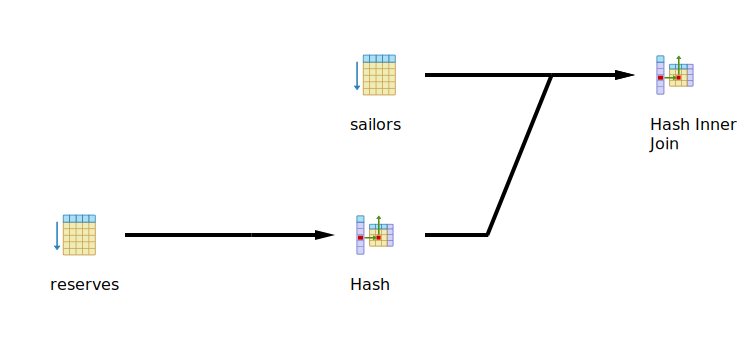
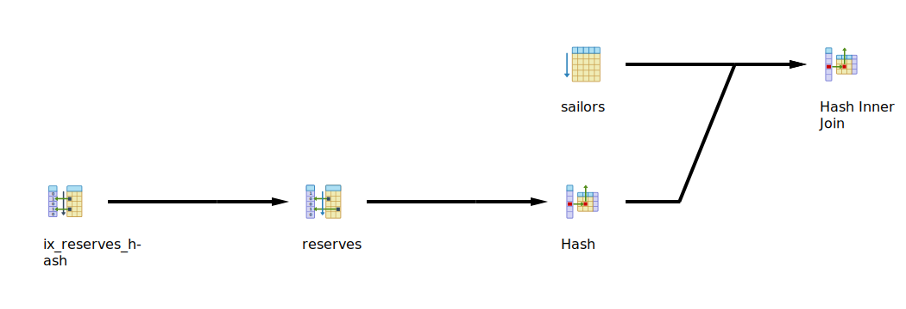

# Results
## Schema 1

### Query 1
```SQL
select *
from (select *
    from student
    where
    department = 'CSEN') as CS1_student
    full outer join
    (select *
    from takes t inner join section s
                    on t.section_id = s.section_id
    where semester = 1
    and
    year = 2019) as sem1_student
            on CS1_student.id = sem1_student.student_id;
```
#### Without Any Optimization



|1st run|2nd run|3rd run|Average|
|---|---|---|---|
|499ms|404ms|285ms|396ms|

#### With B-TREE Indices

```SQL
create index ix_student_btree on student using btree (department);
create index ix_section_btree on "section" using btree (semester,"year");
create index ix_takes_btree on takes using btree (section_id,student_id);
```

|1st run|2nd run|3rd run|Average|Improvment|
|---|---|---|---|---|
|123ms|122ms|135ms|126.67ms|**68%**|

#### With Hash Indices

```SQL
create index ix_student_hash on student using hash (department);
create index ix_section_hash on "section" using hash ("year");
create index ix_takes_hash on takes using hash (student_id);
```


|1st run|2nd run|3rd run|Average|Improvment|
|---|---|---|---|---|
|280ms|290ms|292ms|287.33ms|**27%**|

#### With Brin Indices

```SQL
create index ix_student_brin on student using brin (department);
create index ix_section_brin on "section" using brin ("year");
create index ix_takes_brin on takes using brin (student_id);
```


|1st run|2nd run|3rd run|Average|Improvment|
|---|---|---|---|---|
|304ms|283ms|322ms|303ms|**23%**|

#### With Mixed Indices

```SQL
create index ix_student_hash on student using hash (department);
create index ix_section_btree on "section" using btree (semester,"year");
create index ix_takes_btree on takes using btree (section_id,student_id);
```


|1st run|2nd run|3rd run|Average|Improvment|
|---|---|---|---|---|
|151ms|129ms|128ms|136ms|**65%**|

## Schema 3

### Query 7

```SQL
select s.sname
from sailors s
where
s.sid in( select r.sid
from reserves r
where r.bid = 103 );
```

#### Without Any Optimization



|1st run|2nd run|3rd run|Average|
|---|---|---|---|
|53ms|43ms|43ms|46.33ms|

#### With B-TREE Indices

```SQL
create index ix_sailors_btree on sailors using btree(sid);
create index ix_reserves_btree on reserves using btree(bid);
```

|1st run|2nd run|3rd run|Average|Improvment|
|---|---|---|---|---|
|35ms|37ms|40ms|37.33ms|**19%**|

#### With Hash Indices

```SQL
create index ix_sailors_hash on sailors using hash(sid);
create index ix_reserves_hash on reserves using hash(bid);
```


|1st run|2nd run|3rd run|Average|Improvment|
|---|---|---|---|---|
|40ms|42ms|40ms|40.67ms|**12%**|

#### With Brin Indices

```SQL
create index ix_sailors_brin on sailors using brin(sid);
create index ix_reserves_brin on reserves using brin(bid);
```


|1st run|2nd run|3rd run|Average|Improvment|
|---|---|---|---|---|
|41ms|42ms|44ms|42.33ms|**8%**|

#### With Mixed Indices

```SQL
create index ix_sailors_hash on sailors using hash(sid);
create index ix_reserves_btree on reserves using btree(bid);
```


|1st run|2nd run|3rd run|Average|Improvment|
|---|---|---|---|---|
|41ms|38ms|39ms|39.33ms|**15%**|
