# CSEN604 Databases II Project Report
## Environment

The queries were run on the following environment:

- PostgreSQL 14.3, compiled by Visual C++ build 1914, 64-bit
- Windows 10 Version 21H2 (OS Build 19044.1706)
- Processor AMD Ryzen 9 5900X 12-Core Processor
- RAM 64 GB 3200 MHz

No changes were made to the Postgres default configuration.

## Schema 1

### Query 1


Display a list of all students in the CSEN department, along with the course sections, if any, that they 
        have taken in Semester 1 2019; all course sections from Spring 2019 must be displayed, even if no 
        student from the CSEN department has taken the course section.

```SQL
select *
        from (select *
        from student
        where
        department = 'CSEN') as CS1_student
        full outer join
        (select *
        from takes t inner join section s
        on t.section_id = s.section_id
        where semester = 1
        and
        year = 2019) as sem1_student
        on CS1_student.id = sem1_student.student_id
```
#### **Without Any Optimization** 
Query returns 136611 records

](./images/query_1_no_optimization.svg)
|Run 1|Run 2|Run 3|Average|Planning|Cost|
|---|---|---|---|---|---|
|233.928ms|253.611ms|234.665ms|240.735ms|0.202ms|37451.36|
#### **With B-TREE indices**

```SQL
create index "ix_student_btree" on "student" using btree ("department");
create index "ix_section_btree" on "section" using btree ("semester", "year");
create index "ix_takes_btree" on "takes" using btree ("section_id", "student_id");

```
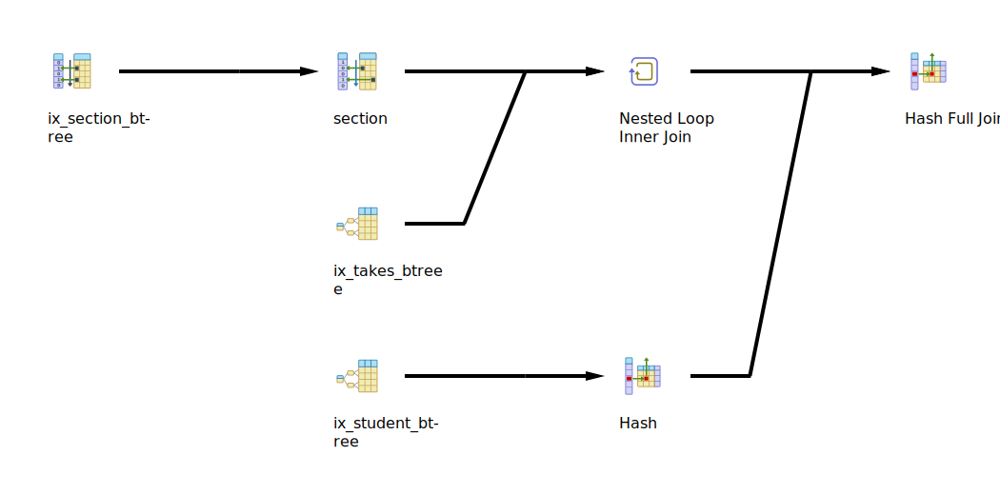
|Run 1|Run 2|Run 3|Average|Planning|Cost|Cost vs w/o Indexes|Time vs w/o Indexes|
|---|---|---|---|---|---|---|---|
|103.546ms|74.385ms|68.097ms|82.009ms|0.257ms|33955.53|91%|34%|
#### **With Hash indices**

```SQL
create index "ix_student_hash" on "student" using hash ("department");
create index "ix_section_hash" on "section" using hash ("year");
create index "ix_takes_hash" on "takes" using hash ("student_id");

```

|Run 1|Run 2|Run 3|Average|Planning|Cost|Cost vs w/o Indexes|Time vs w/o Indexes|
|---|---|---|---|---|---|---|---|
|213.008ms|218.789ms|211.343ms|214.38ms|0.253ms|36145.62|97%|89%|
#### **With BRIN indices**

```SQL
create index "ix_student_brin" on "student" using brin ("department");
create index "ix_section_brin" on "section" using brin ("semester", "year");
create index "ix_takes_brin" on "takes" using brin ("student_id");

```

|Run 1|Run 2|Run 3|Average|Planning|Cost|Cost vs w/o Indexes|Time vs w/o Indexes|
|---|---|---|---|---|---|---|---|
|219.42ms|219.346ms|211.564ms|216.777ms|0.208ms|36437.81|97%|90%|
#### **With Mixed indices**

```SQL
create index "ix_student_hash" on "student" using hash ("department");
create index "ix_section_btree" on "section" using btree ("semester", "year");
create index "ix_takes_btree" on "takes" using btree ("section_id", "student_id");

```
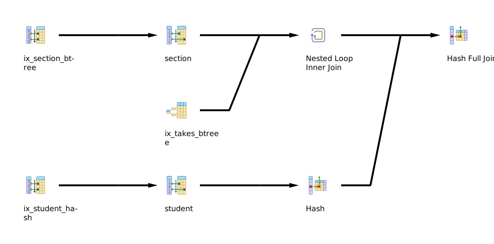
|Run 1|Run 2|Run 3|Average|Planning|Cost|Cost vs w/o Indexes|Time vs w/o Indexes|
|---|---|---|---|---|---|---|---|
|78.041ms|67.96ms|67.818ms|71.273ms|0.222ms|34779.02|93%|30%|
#### **Improved SQL** 


The original query had a flaw. 
        It was supposed to get all courses from Spring 2019 even if no CSEN student took the course. 
        However, since it was joining with `takes`, it would return the same course many times.
        For example, if 100 *non-CSEN* students took course, the course would be listed 100 times.
        Fixing the query significantly reduced the number of returned rows while maintaining the original requirement 
        and therefore had significant impact on execution time.

***We recommend creating B-Tree indices on `student` `section` and `takes` tables as indicated in the create index statements below.***
        

```SQL
with s as (select * from section where semester = 1 and year = 2019),
        cs1_student as (select * from student where department = 'CSEN'),
        sem1_student as (select takes.*, s.* from takes inner join s on takes.section_id = s.section_id inner join cs1_student on cs1_student.id = takes.student_id)
        select * from cs1_student full outer join sem1_student on CS1_student.id = sem1_student.student_id;
```
#### **Without Any Optimization** 
Query returns 3242 records

](./images/query_1_improved_no_optimization.svg)
|Run 1|Run 2|Run 3|Average|Planning|Cost|Cost vs Unoptimized|Time vs Unoptimized|
|---|---|---|---|---|---|---|---|
|20.399ms|19.095ms|19.003ms|19.499ms|0.32ms|33145.21|89%|8%|
#### **With B-TREE indices**

```SQL
create index "ix_student_btree" on "student" using btree ("department");
create index "ix_section_btree" on "section" using btree ("semester", "year");
create index "ix_takes_btree" on "takes" using btree ("section_id", "student_id");

```

|Run 1|Run 2|Run 3|Average|Planning|Cost|Cost vs w/o Indexes|Time vs w/o Indexes|Cost vs Unoptimized|Time vs Unoptimized|
|---|---|---|---|---|---|---|---|---|---|
|16.329ms|14.642ms|13.219ms|14.73ms|0.358ms|31240.8|94%|76%|92%|18%|
#### **With Hash indices**

```SQL
create index "ix_student_hash" on "student" using hash ("department");
create index "ix_section_hash" on "section" using hash ("year");
create index "ix_takes_hash" on "takes" using hash ("student_id");

```

|Run 1|Run 2|Run 3|Average|Planning|Cost|Cost vs w/o Indexes|Time vs w/o Indexes|Cost vs Unoptimized|Time vs Unoptimized|
|---|---|---|---|---|---|---|---|---|---|
|15.23ms|12.724ms|13.37ms|13.775ms|0.292ms|32841.49|99%|71%|91%|6%|
#### **With BRIN indices**

```SQL
create index "ix_student_brin" on "student" using brin ("department");
create index "ix_section_brin" on "section" using brin ("semester", "year");
create index "ix_takes_brin" on "takes" using brin ("student_id");

```
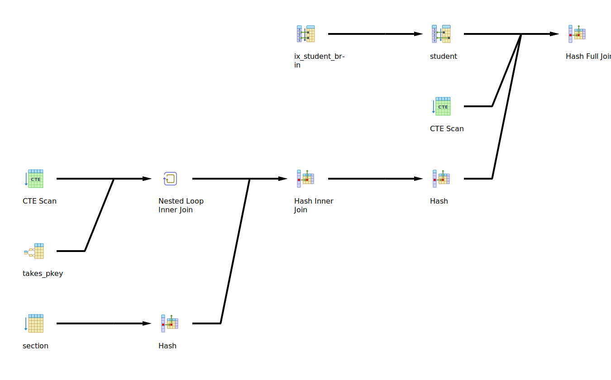
|Run 1|Run 2|Run 3|Average|Planning|Cost|Cost vs w/o Indexes|Time vs w/o Indexes|Cost vs Unoptimized|Time vs Unoptimized|
|---|---|---|---|---|---|---|---|---|---|
|14.582ms|13.907ms|13.276ms|13.922ms|0.309ms|32878.83|99%|71%|90%|6%|
#### **With Mixed indices**

```SQL
create index "ix_student_hash" on "student" using hash ("department");
create index "ix_section_btree" on "section" using btree ("semester", "year");
create index "ix_takes_btree" on "takes" using btree ("section_id", "student_id");

```

|Run 1|Run 2|Run 3|Average|Planning|Cost|Cost vs w/o Indexes|Time vs w/o Indexes|Cost vs Unoptimized|Time vs Unoptimized|
|---|---|---|---|---|---|---|---|---|---|
|13.069ms|12.574ms|13.676ms|13.106ms|0.368ms|31916.62|96%|67%|92%|18%|

## Schema 2

### Query 2


Select all projects if employee with last name `'employee1'` is a manager of any department, otherwiser get projects employee with last name `'employee1'` is working on.

```SQL
select distinct pnumber 
        from project 
        where pnumber in
        (select pnumber 
            from project, department d, employee e 
            where e.dno = d.dnumber 
            and d.mgr_snn = ssn 
            and e.lname='employee1' ) 
            or pnumber in (select pno 
                from works_on, employee 
                where essn=ssn and lname='employee1' )
```
#### **Without Any Optimization** 
Query returns 600 records

](./images/query_2_no_optimization.svg)
|Run 1|Run 2|Run 3|Average|Planning|Cost|
|---|---|---|---|---|---|
|7.236ms|5.013ms|4.648ms|5.632ms|0.328ms|1062.24|
#### **With B-TREE indices**

```SQL
create index "ix_department_btree" on "department" using btree ("mgr_snn") include ("dnumber") ;
create index "ix_employee_btree" on "employee" using btree ("lname") include ("dno") ;
create index "ix_project_btree" on "project" using btree ("pnumber");
create index "ix_works_on_btree" on "works_on" using btree ("essn") include ("pno") ;

```

|Run 1|Run 2|Run 3|Average|Planning|Cost|Cost vs w/o Indexes|Time vs w/o Indexes|
|---|---|---|---|---|---|---|---|
|4.064ms|3.951ms|3.784ms|3.933ms|0.364ms|607.54|57%|70%|
#### **With Hash indices**

```SQL
create index "ix_department_hash" on "department" using hash ("mgr_snn");
create index "ix_employee_hash" on "employee" using hash ("lname");
create index "ix_project_hash" on "project" using hash ("pnumber");
create index "ix_works_on_hash" on "works_on" using hash ("essn");

```

|Run 1|Run 2|Run 3|Average|Planning|Cost|Cost vs w/o Indexes|Time vs w/o Indexes|
|---|---|---|---|---|---|---|---|
|3.809ms|3.879ms|3.773ms|3.82ms|0.287ms|607.25|57%|68%|
#### **With BRIN indices**

```SQL
create index "ix_department_brin" on "department" using brin ("mgr_snn");
create index "ix_employee_brin" on "employee" using brin ("lname");
create index "ix_project_brin" on "project" using brin ("pnumber");
create index "ix_works_on_brin" on "works_on" using brin ("essn");

```
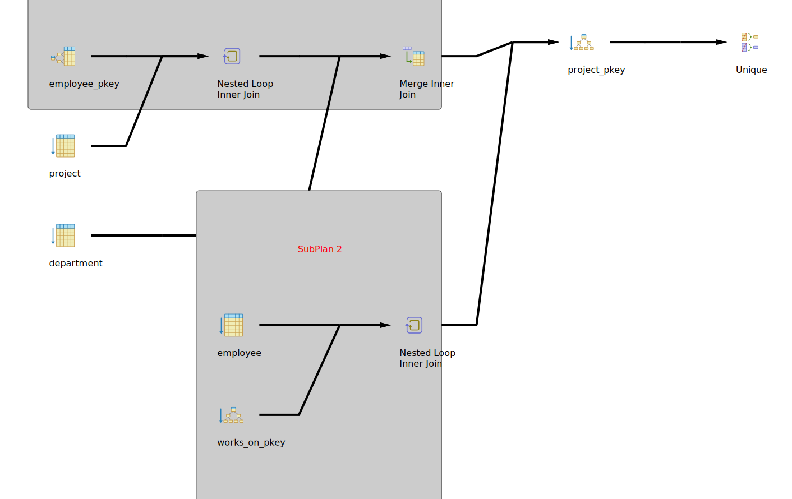
|Run 1|Run 2|Run 3|Average|Planning|Cost|Cost vs w/o Indexes|Time vs w/o Indexes|
|---|---|---|---|---|---|---|---|
|4.625ms|5.178ms|4.549ms|4.784ms|0.326ms|1062.24|100%|85%|
#### **With Mixed indices**

```SQL
create index "ix_department_btree" on "department" using btree ("mgr_snn");
create index "ix_employee_hash" on "employee" using hash ("lname");
create index "ix_project_hash" on "project" using hash ("pnumber");
create index "ix_works_on_btree" on "works_on" using btree ("essn");

```

|Run 1|Run 2|Run 3|Average|Planning|Cost|Cost vs w/o Indexes|Time vs w/o Indexes|
|---|---|---|---|---|---|---|---|
|3.983ms|3.845ms|3.987ms|3.938ms|0.351ms|607.25|57%|70%|
#### **Improved SQL** 


Table project is not used as condition at all in the first inner query of the original query,
         also the data from department or employee. The query output varies only by the count. 
         Hence we wrote improved query like that. The new query has better performance with and without indexes.
         
***We recommend creating B-Tree indices on `department`, `employee`, `works_on` and `project` tables as indicated in the create index statements below.***
         

```SQL
with c as (select count(*) n from employee e, department d where mgr_snn = ssn and dno = dnumber and lname = 'employee1')
    select pnumber from project 
    where pnumber in (select pno as pnumber from works_on, employee where essn=ssn and lname = 'employee1')
    or (select n from c) <> 0
```
#### **Without Any Optimization** 
Query returns 600 records

](./images/query_2_improved_no_optimization.svg)
|Run 1|Run 2|Run 3|Average|Planning|Cost|Cost vs Unoptimized|Time vs Unoptimized|
|---|---|---|---|---|---|---|---|
|3.44ms|3.17ms|2.863ms|3.158ms|0.263ms|1210.12|114%|56%|
#### **With B-TREE indices**

```SQL
create index "ix_department_btree" on "department" using btree ("mgr_snn") include ("dnumber") ;
create index "ix_employee_btree" on "employee" using btree ("lname") include ("dno") ;
create index "ix_project_btree" on "project" using btree ("pnumber");
create index "ix_works_on_btree" on "works_on" using btree ("essn") include ("pno") ;

```

|Run 1|Run 2|Run 3|Average|Planning|Cost|Cost vs w/o Indexes|Time vs w/o Indexes|Cost vs Unoptimized|Time vs Unoptimized|
|---|---|---|---|---|---|---|---|---|---|
|1.194ms|1.121ms|1.182ms|1.166ms|0.313ms|299.28|25%|37%|49%|30%|
#### **With Hash indices**

```SQL
create index "ix_department_hash" on "department" using hash ("mgr_snn");
create index "ix_employee_hash" on "employee" using hash ("lname");
create index "ix_project_hash" on "project" using hash ("pnumber");
create index "ix_works_on_hash" on "works_on" using hash ("essn");

```
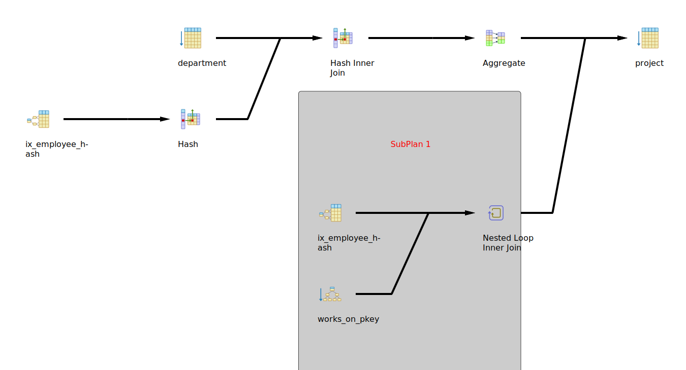
|Run 1|Run 2|Run 3|Average|Planning|Cost|Cost vs w/o Indexes|Time vs w/o Indexes|Cost vs Unoptimized|Time vs Unoptimized|
|---|---|---|---|---|---|---|---|---|---|
|1.118ms|1.362ms|1.109ms|1.196ms|0.267ms|298.71|25%|38%|49%|31%|
#### **With BRIN indices**

```SQL
create index "ix_department_brin" on "department" using brin ("mgr_snn");
create index "ix_employee_brin" on "employee" using brin ("lname");
create index "ix_project_brin" on "project" using brin ("pnumber");
create index "ix_works_on_brin" on "works_on" using brin ("essn");

```

|Run 1|Run 2|Run 3|Average|Planning|Cost|Cost vs w/o Indexes|Time vs w/o Indexes|Cost vs Unoptimized|Time vs Unoptimized|
|---|---|---|---|---|---|---|---|---|---|
|2.646ms|2.644ms|2.675ms|2.655ms|0.299ms|1200.31|99%|84%|113%|55%|
#### **With Mixed indices**

```SQL
create index "ix_department_btree" on "department" using btree ("mgr_snn");
create index "ix_employee_hash" on "employee" using hash ("lname");
create index "ix_project_hash" on "project" using hash ("pnumber");
create index "ix_works_on_btree" on "works_on" using btree ("essn");

```

|Run 1|Run 2|Run 3|Average|Planning|Cost|Cost vs w/o Indexes|Time vs w/o Indexes|Cost vs Unoptimized|Time vs Unoptimized|
|---|---|---|---|---|---|---|---|---|---|
|1.265ms|1.083ms|1.12ms|1.156ms|0.282ms|298.71|25%|37%|49%|29%|
### Query 3


Select the names of employees whose salary is greater than the salary of all the employees in 
        department 5

```SQL
select lname, fname 
        from employee 
        where salary > all ( 
        select salary 
        from employee 
        where dno=5 )
```
#### **Without Any Optimization** 
Query returns 124 records

](./images/query_3_no_optimization.svg)
|Run 1|Run 2|Run 3|Average|Planning|Cost|
|---|---|---|---|---|---|
|6.691ms|6.649ms|6.317ms|6.552ms|0.047ms|3711903|
#### **With B-TREE indices**

```SQL
create index "ix_employee_btree" on "employee" using btree ("salary");
create index "ix_employee_btree2" on "employee" using btree ("dno") include ("salary") ;

```

|Run 1|Run 2|Run 3|Average|Planning|Cost|Cost vs w/o Indexes|Time vs w/o Indexes|
|---|---|---|---|---|---|---|---|
|5.837ms|5.73ms|5.642ms|5.736ms|0.069ms|57263.28|2%|88%|
#### **With Hash indices**

```SQL
create index "ix_employee_hash" on "employee" using hash ("salary");
create index "ix_employee_hash2" on "employee" using hash ("dno");

```

|Run 1|Run 2|Run 3|Average|Planning|Cost|Cost vs w/o Indexes|Time vs w/o Indexes|
|---|---|---|---|---|---|---|---|
|5.625ms|5.679ms|5.431ms|5.578ms|0.043ms|1750150.61|47%|85%|
#### **With BRIN indices**

```SQL
create index "ix_employee_brin" on "employee" using brin ("salary");
create index "ix_employee_brin2" on "employee" using brin ("dno");

```
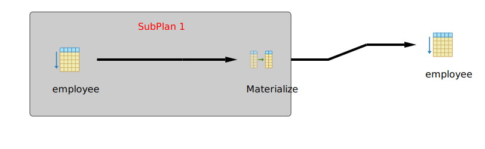
|Run 1|Run 2|Run 3|Average|Planning|Cost|Cost vs w/o Indexes|Time vs w/o Indexes|
|---|---|---|---|---|---|---|---|
|6.811ms|6.45ms|6.353ms|6.538ms|0.057ms|3711903|100%|100%|
#### **With Mixed indices**

```SQL
create index "ix_employee_brin" on "employee" using brin ("salary");
create index "ix_employee_btree" on "employee" using btree ("dno") include ("salary") ;

```

|Run 1|Run 2|Run 3|Average|Planning|Cost|Cost vs w/o Indexes|Time vs w/o Indexes|
|---|---|---|---|---|---|---|---|
|5.465ms|5.493ms|5.448ms|5.469ms|0.055ms|57263.28|2%|83%|
#### **Improved SQL** 


using `salary > (select max(salary))` instead of `salary > all` 
        yielded a drastically lower cost and execution time since the 
        query engine is comparing the salary with the maximum value instead of comparing with all values. 
        The improvement is noticed with and without using indices.
        
***We recommend creating B-Tree indices on `employee` table as indicated in the create index statements below.***
        

```SQL

        select lname, fname 
        from employee 
        where salary > ( 
        select max(salary)
        from employee 
        where dno=5 )
        
```
#### **Without Any Optimization** 
Query returns 124 records

](./images/query_3_improved_no_optimization.svg)
|Run 1|Run 2|Run 3|Average|Planning|Cost|Cost vs Unoptimized|Time vs Unoptimized|
|---|---|---|---|---|---|---|---|
|1.973ms|1.99ms|1.858ms|1.94ms|0.078ms|926.32|0%|30%|
#### **With B-TREE indices**

```SQL
create index "ix_employee_btree" on "employee" using btree ("salary");
create index "ix_employee_btree2" on "employee" using btree ("dno") include ("salary") ;

```
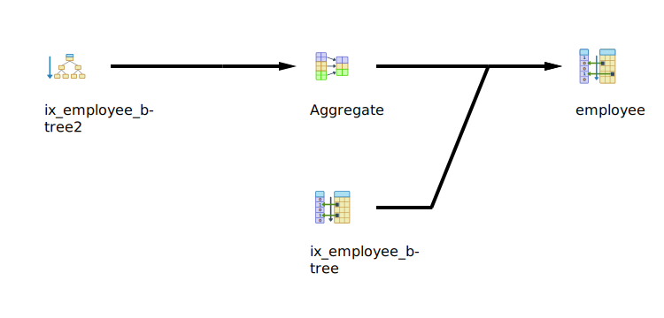
|Run 1|Run 2|Run 3|Average|Planning|Cost|Cost vs w/o Indexes|Time vs w/o Indexes|Cost vs Unoptimized|Time vs Unoptimized|
|---|---|---|---|---|---|---|---|---|---|
|0.272ms|0.097ms|0.109ms|0.159ms|0.107ms|438.05|47%|8%|1%|3%|
#### **With Hash indices**

```SQL
create index "ix_employee_hash" on "employee" using hash ("salary");
create index "ix_employee_hash2" on "employee" using hash ("dno");

```

|Run 1|Run 2|Run 3|Average|Planning|Cost|Cost vs w/o Indexes|Time vs w/o Indexes|Cost vs Unoptimized|Time vs Unoptimized|
|---|---|---|---|---|---|---|---|---|---|
|1.198ms|1.075ms|1.02ms|1.098ms|0.09ms|686.06|74%|57%|0%|20%|
#### **With BRIN indices**

```SQL
create index "ix_employee_brin" on "employee" using brin ("salary");
create index "ix_employee_brin2" on "employee" using brin ("dno");

```

|Run 1|Run 2|Run 3|Average|Planning|Cost|Cost vs w/o Indexes|Time vs w/o Indexes|Cost vs Unoptimized|Time vs Unoptimized|
|---|---|---|---|---|---|---|---|---|---|
|2.118ms|2.036ms|1.848ms|2.001ms|0.111ms|926.32|100%|103%|0%|31%|
#### **With Mixed indices**

```SQL
create index "ix_employee_brin" on "employee" using brin ("salary");
create index "ix_employee_btree" on "employee" using btree ("dno") include ("salary") ;

```
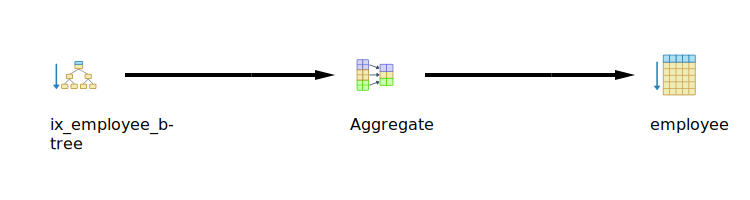
|Run 1|Run 2|Run 3|Average|Planning|Cost|Cost vs w/o Indexes|Time vs w/o Indexes|Cost vs Unoptimized|Time vs Unoptimized|
|---|---|---|---|---|---|---|---|---|---|
|1.109ms|1.281ms|1.135ms|1.175ms|0.101ms|469.77|51%|61%|1%|21%|
### Query 4


Retrieve the name of each employee who has a dependent with the same first name and is the 
        same sex as the employee.

```SQL
select e.fname, e.lname 
        from employee as e 
        where e.ssn in ( 
        select essn 
        from dependent as d 
        where e.fname = d.dependent_name 
        and 
        e.sex = d.sex )
```
#### **Without Any Optimization** 
Query returns 307 records

](./images/query_4_no_optimization.svg)
|Run 1|Run 2|Run 3|Average|Planning|Cost|
|---|---|---|---|---|---|
|656.699ms|657.073ms|664.529ms|659.434ms|0.072ms|148483|
#### **With B-TREE indices**

```SQL
create index "ix_employee_btree" on "employee" using btree ("fname", "sex") include ("ssn") ;
create index "ix_dependent_btree" on "dependent" using btree ("dependent_name", "sex", "essn");

```
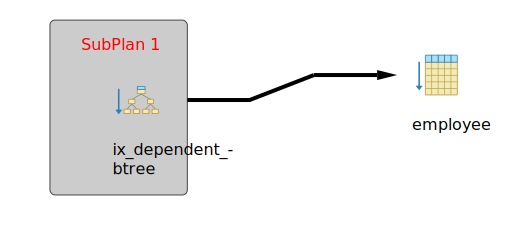
|Run 1|Run 2|Run 3|Average|Planning|Cost|Cost vs w/o Indexes|Time vs w/o Indexes|
|---|---|---|---|---|---|---|---|
|39.03ms|38.726ms|38.333ms|38.696ms|0.085ms|69043|46%|6%|
#### **With Hash indices**

```SQL
create index "ix_employee_hash" on "employee" using hash ("ssn");
create index "ix_dependent_hash" on "dependent" using hash ("essn");

```
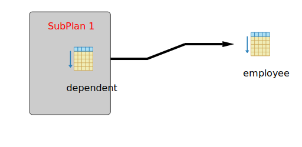
|Run 1|Run 2|Run 3|Average|Planning|Cost|Cost vs w/o Indexes|Time vs w/o Indexes|
|---|---|---|---|---|---|---|---|
|653.918ms|655.116ms|664.307ms|657.78ms|0.075ms|148483|100%|100%|
#### **With BRIN indices**

```SQL
create index "ix_employee_brin" on "employee" using brin ("ssn");
create index "ix_dependent_brin" on "dependent" using brin ("dependent_name");

```

|Run 1|Run 2|Run 3|Average|Planning|Cost|Cost vs w/o Indexes|Time vs w/o Indexes|
|---|---|---|---|---|---|---|---|
|666.562ms|664.994ms|656.225ms|662.594ms|0.091ms|148483|100%|100%|
#### **With Mixed indices**

```SQL
create index "ix_employee_hash" on "employee" using hash ("ssn");
create index "ix_dependent_btree" on "dependent" using btree ("dependent_name");

```
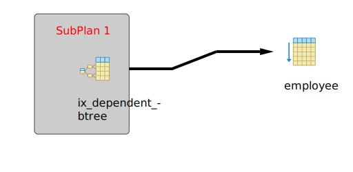
|Run 1|Run 2|Run 3|Average|Planning|Cost|Cost vs w/o Indexes|Time vs w/o Indexes|
|---|---|---|---|---|---|---|---|
|37.198ms|37.211ms|37.086ms|37.165ms|0.108ms|69043|46%|6%|
#### **Improved SQL** 


The original query caused the Postgresql engine to
        scan the employee table as shown in query plan diagram above. 
        When chaning the query to use `exists` keyword instead of `in`, 
        the engine used another plan where it did a merge inner join 
        and an index scan instead of a table scan on employee table. 
        In both queries the dependent table is scanned, 
        but using the index in the merge inner join resulted in a better performance.
        
***We recommend creating B-Tree indices on `dependent` and `employee` tables as indicated in the create index statements below.***
        

```SQL
select e.fname, e.lname 
        from employee as e 
        where EXISTS ( 
        select essn 
        from dependent as d 
        where e.fname = d.dependent_name 
        and 
        e.sex = d.sex and d.essn = e.ssn)
```
#### **Without Any Optimization** 
Query returns 307 records

](./images/query_4_improved_no_optimization.svg)
|Run 1|Run 2|Run 3|Average|Planning|Cost|Cost vs Unoptimized|Time vs Unoptimized|
|---|---|---|---|---|---|---|---|
|0.376ms|0.397ms|0.544ms|0.439ms|0.175ms|94.3|0%|0%|
#### **With B-TREE indices**

```SQL
create index "ix_employee_btree" on "employee" using btree ("fname", "sex") include ("ssn") ;
create index "ix_dependent_btree" on "dependent" using btree ("dependent_name", "sex", "essn");

```

|Run 1|Run 2|Run 3|Average|Planning|Cost|Cost vs w/o Indexes|Time vs w/o Indexes|Cost vs Unoptimized|Time vs Unoptimized|
|---|---|---|---|---|---|---|---|---|---|
|0.403ms|0.352ms|0.454ms|0.403ms|0.2ms|94.3|100%|92%|0%|1%|
#### **With Hash indices**

```SQL
create index "ix_employee_hash" on "employee" using hash ("ssn");
create index "ix_dependent_hash" on "dependent" using hash ("essn");

```

|Run 1|Run 2|Run 3|Average|Planning|Cost|Cost vs w/o Indexes|Time vs w/o Indexes|Cost vs Unoptimized|Time vs Unoptimized|
|---|---|---|---|---|---|---|---|---|---|
|0.378ms|0.357ms|0.358ms|0.364ms|0.141ms|94.3|100%|83%|0%|0%|
#### **With BRIN indices**

```SQL
create index "ix_employee_brin" on "employee" using brin ("ssn");
create index "ix_dependent_brin" on "dependent" using brin ("dependent_name");

```

|Run 1|Run 2|Run 3|Average|Planning|Cost|Cost vs w/o Indexes|Time vs w/o Indexes|Cost vs Unoptimized|Time vs Unoptimized|
|---|---|---|---|---|---|---|---|---|---|
|0.383ms|0.386ms|0.366ms|0.378ms|0.162ms|94.3|100%|86%|0%|0%|
#### **With Mixed indices**

```SQL
create index "ix_employee_hash" on "employee" using hash ("ssn");
create index "ix_dependent_btree" on "dependent" using btree ("dependent_name");

```
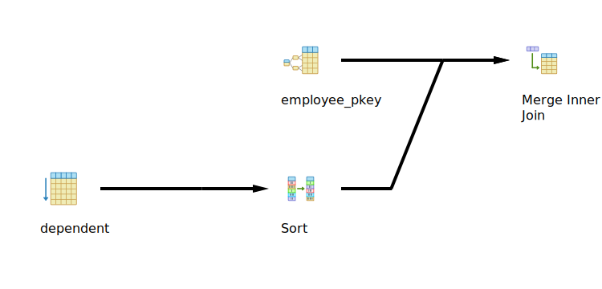
|Run 1|Run 2|Run 3|Average|Planning|Cost|Cost vs w/o Indexes|Time vs w/o Indexes|Cost vs Unoptimized|Time vs Unoptimized|
|---|---|---|---|---|---|---|---|---|---|
|0.382ms|0.39ms|0.384ms|0.385ms|0.179ms|94.3|100%|88%|0%|1%|
### Query 5


Retrieve the names of employees who have dependents.

```SQL
select fname, lname 
        from employee 
        where exists ( select * 
         from dependent 
         where ssn=essn )
```
#### **Without Any Optimization** 
Query returns 700 records

](./images/query_5_no_optimization.svg)
|Run 1|Run 2|Run 3|Average|Planning|Cost|
|---|---|---|---|---|---|
|0.351ms|0.283ms|0.28ms|0.305ms|0.083ms|90.8|
#### **With B-TREE indices**

```SQL
create index "ix_employee_btree" on "employee" using btree ("ssn") include ("fname", "lname");
create index "ix_dependent_btree" on "dependent" using btree ("essn");

```
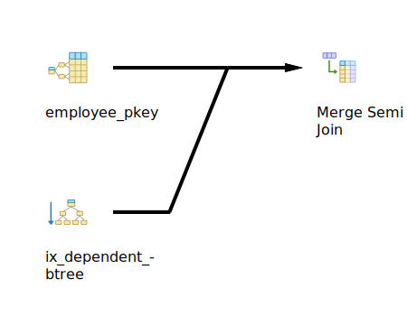
|Run 1|Run 2|Run 3|Average|Planning|Cost|Cost vs w/o Indexes|Time vs w/o Indexes|
|---|---|---|---|---|---|---|---|
|0.268ms|0.379ms|0.245ms|0.297ms|0.114ms|78.75|87%|97%|
#### **With Hash indices**

```SQL
create index "ix_employee_hash" on "employee" using hash ("ssn");
create index "ix_dependent_hash" on "dependent" using hash ("essn");

```

|Run 1|Run 2|Run 3|Average|Planning|Cost|Cost vs w/o Indexes|Time vs w/o Indexes|
|---|---|---|---|---|---|---|---|
|0.3ms|0.308ms|0.284ms|0.297ms|0.1ms|90.8|100%|97%|
#### **With BRIN indices**

```SQL
create index "ix_employee_brin" on "employee" using brin ("ssn");
create index "ix_dependent_brin" on "dependent" using brin ("essn");

```
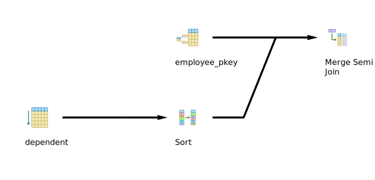
|Run 1|Run 2|Run 3|Average|Planning|Cost|Cost vs w/o Indexes|Time vs w/o Indexes|
|---|---|---|---|---|---|---|---|
|0.446ms|0.41ms|0.3ms|0.385ms|0.137ms|90.8|100%|126%|
#### **With Mixed indices**

```SQL
create index "ix_employee_hash" on "employee" using hash ("ssn");
create index "ix_dependent_btree" on "dependent" using btree ("essn");

```

|Run 1|Run 2|Run 3|Average|Planning|Cost|Cost vs w/o Indexes|Time vs w/o Indexes|
|---|---|---|---|---|---|---|---|
|0.314ms|0.261ms|0.24ms|0.272ms|0.105ms|78.75|87%|89%|
#### **Improved SQL** 


We couldn't improve this query. 
        Here the data returned from dependents is not filtered unlike query 4.
        So the engine used merge semi join in both the cases here because merge joins are preferred when the data on both sides of the join is large.
        Therefore in query 5 changing between `in' and `exists` keywords had no effect while in query 4 it had. 

***We recommend creating B-Tree indices on `dependent` and `employee` tables as indicated in the create index statements below.***
        

```SQL
select fname, lname 
        from employee 
        where ssn in ( select essn 
         from dependent 
         )
```
#### **Without Any Optimization** 
Query returns 700 records

](./images/query_5_improved_no_optimization.svg)
|Run 1|Run 2|Run 3|Average|Planning|Cost|Cost vs Unoptimized|Time vs Unoptimized|
|---|---|---|---|---|---|---|---|
|0.385ms|0.287ms|0.296ms|0.323ms|0.11ms|90.8|100%|106%|
#### **With B-TREE indices**

```SQL
create index "ix_employee_btree" on "employee" using btree ("ssn") include ("fname", "lname");
create index "ix_dependent_btree" on "dependent" using btree ("essn");

```

|Run 1|Run 2|Run 3|Average|Planning|Cost|Cost vs w/o Indexes|Time vs w/o Indexes|Cost vs Unoptimized|Time vs Unoptimized|
|---|---|---|---|---|---|---|---|---|---|
|0.386ms|0.253ms|0.244ms|0.294ms|0.128ms|78.75|87%|91%|100%|99%|
#### **With Hash indices**

```SQL
create index "ix_employee_hash" on "employee" using hash ("ssn");
create index "ix_dependent_hash" on "dependent" using hash ("essn");

```

|Run 1|Run 2|Run 3|Average|Planning|Cost|Cost vs w/o Indexes|Time vs w/o Indexes|Cost vs Unoptimized|Time vs Unoptimized|
|---|---|---|---|---|---|---|---|---|---|
|0.324ms|0.306ms|0.279ms|0.303ms|0.103ms|90.8|100%|94%|100%|102%|
#### **With BRIN indices**

```SQL
create index "ix_employee_brin" on "employee" using brin ("ssn");
create index "ix_dependent_brin" on "dependent" using brin ("essn");

```

|Run 1|Run 2|Run 3|Average|Planning|Cost|Cost vs w/o Indexes|Time vs w/o Indexes|Cost vs Unoptimized|Time vs Unoptimized|
|---|---|---|---|---|---|---|---|---|---|
|0.308ms|0.448ms|0.282ms|0.346ms|0.115ms|90.8|100%|107%|100%|90%|
#### **With Mixed indices**

```SQL
create index "ix_employee_hash" on "employee" using hash ("ssn");
create index "ix_dependent_btree" on "dependent" using btree ("essn");

```

|Run 1|Run 2|Run 3|Average|Planning|Cost|Cost vs w/o Indexes|Time vs w/o Indexes|Cost vs Unoptimized|Time vs Unoptimized|
|---|---|---|---|---|---|---|---|---|---|
|0.268ms|0.246ms|0.24ms|0.251ms|0.098ms|78.75|87%|78%|100%|92%|
### Query 6


For each department that has more than five employees, retrieve the department number and the 
        number of its employees who are making more than $40,000.

```SQL
select dnumber, count(*) 
        from department, employee 
        where dnumber=dno 
        and 
        salary > 40000 
        and 
        dno in ( 
         select dno 
         from employee 
         group by dno 
         having count (*) > 5) 
        group by dnumber
```
#### **Without Any Optimization** 
Query returns 150 records

](./images/query_6_no_optimization.svg)
|Run 1|Run 2|Run 3|Average|Planning|Cost|
|---|---|---|---|---|---|
|6.17ms|5.867ms|6.06ms|6.032ms|0.197ms|1009.39|
#### **With B-TREE indices**

```SQL
create index "ix_employee_btree" on "employee" using btree ("dno") include ("salary");
create index "ix_department_btree" on "department" using btree ("dnumber");

```
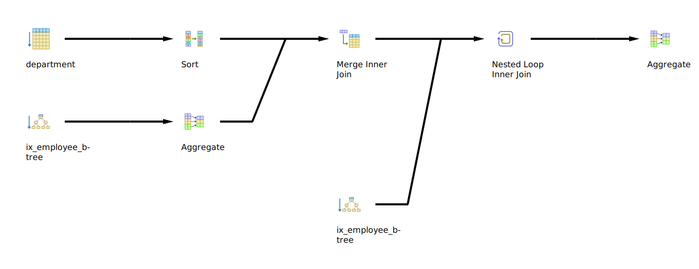
|Run 1|Run 2|Run 3|Average|Planning|Cost|Cost vs w/o Indexes|Time vs w/o Indexes|
|---|---|---|---|---|---|---|---|
|3.78ms|3.205ms|3.512ms|3.499ms|0.27ms|732.65|73%|58%|
#### **With Hash indices**

```SQL
create index "ix_employee_hash" on "employee" using hash ("dno");
create index "ix_department_hash" on "department" using hash ("dnumber");

```

|Run 1|Run 2|Run 3|Average|Planning|Cost|Cost vs w/o Indexes|Time vs w/o Indexes|
|---|---|---|---|---|---|---|---|
|5.766ms|5.59ms|5.414ms|5.59ms|0.224ms|1009.39|100%|93%|
#### **With BRIN indices**

```SQL
create index "ix_employee_brin" on "employee" using brin ("dno");
create index "ix_department_brin" on "department" using brin ("dnumber");

```
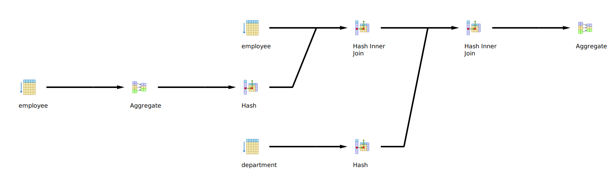
|Run 1|Run 2|Run 3|Average|Planning|Cost|Cost vs w/o Indexes|Time vs w/o Indexes|
|---|---|---|---|---|---|---|---|
|5.867ms|5.446ms|5.706ms|5.673ms|0.234ms|1009.39|100%|94%|
#### **With Mixed indices**

```SQL
create index "ix_employee_btree" on "employee" using btree ("dno") include ("salary");
create index "ix_department_hash" on "department" using hash ("dnumber");

```

|Run 1|Run 2|Run 3|Average|Planning|Cost|Cost vs w/o Indexes|Time vs w/o Indexes|
|---|---|---|---|---|---|---|---|
|3.551ms|3.207ms|3.19ms|3.316ms|0.237ms|732.65|73%|55%|
#### **Improved SQL** 


The original query used the `dnumber` column from `department` table and no other columns. 
        Since that column is already in the `employee` table, there is no need to include `department` table in the query.
        The improved query had a slightly lower cost because of that.

***We recommend creating B-Tree indices on `department` and `employee` tables as indicated in the create index statements below.***
        

```SQL
select dno, count(*) 
    from employee 
    where salary > 40000 and dno in ( 
        select dno 
        from employee 
        group by dno 
        having count (*) > 5) 
    group by dno
```
#### **Without Any Optimization** 
Query returns 150 records

](./images/query_6_improved_no_optimization.svg)
|Run 1|Run 2|Run 3|Average|Planning|Cost|Cost vs Unoptimized|Time vs Unoptimized|
|---|---|---|---|---|---|---|---|
|5.067ms|5.047ms|4.876ms|4.997ms|0.082ms|998.29|99%|83%|
#### **With B-TREE indices**

```SQL
create index "ix_employee_btree" on "employee" using btree ("dno") include ("salary");
create index "ix_department_btree" on "department" using btree ("dnumber");

```

|Run 1|Run 2|Run 3|Average|Planning|Cost|Cost vs w/o Indexes|Time vs w/o Indexes|Cost vs Unoptimized|Time vs Unoptimized|
|---|---|---|---|---|---|---|---|---|---|
|3.364ms|3.122ms|3.102ms|3.196ms|0.106ms|793.02|79%|64%|108%|91%|
#### **With Hash indices**

```SQL
create index "ix_employee_hash" on "employee" using hash ("dno");
create index "ix_department_hash" on "department" using hash ("dnumber");

```

|Run 1|Run 2|Run 3|Average|Planning|Cost|Cost vs w/o Indexes|Time vs w/o Indexes|Cost vs Unoptimized|Time vs Unoptimized|
|---|---|---|---|---|---|---|---|---|---|
|4.987ms|5.01ms|4.883ms|4.96ms|0.106ms|998.29|100%|99%|99%|89%|
#### **With BRIN indices**

```SQL
create index "ix_employee_brin" on "employee" using brin ("dno");
create index "ix_department_brin" on "department" using brin ("dnumber");

```

|Run 1|Run 2|Run 3|Average|Planning|Cost|Cost vs w/o Indexes|Time vs w/o Indexes|Cost vs Unoptimized|Time vs Unoptimized|
|---|---|---|---|---|---|---|---|---|---|
|5.087ms|5.372ms|4.836ms|5.098ms|0.101ms|998.29|100%|102%|99%|90%|
#### **With Mixed indices**

```SQL
create index "ix_employee_btree" on "employee" using btree ("dno") include ("salary");
create index "ix_department_hash" on "department" using hash ("dnumber");

```
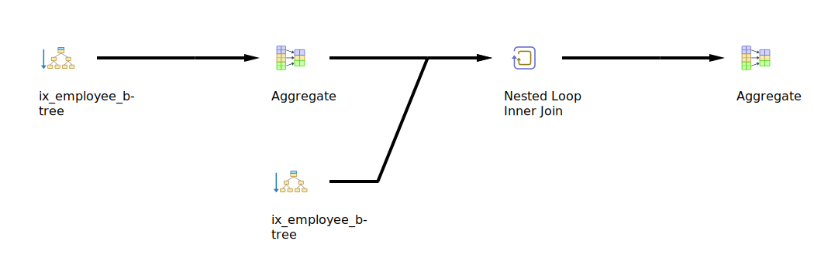
|Run 1|Run 2|Run 3|Average|Planning|Cost|Cost vs w/o Indexes|Time vs w/o Indexes|Cost vs Unoptimized|Time vs Unoptimized|
|---|---|---|---|---|---|---|---|---|---|
|3.291ms|3.122ms|3.311ms|3.241ms|0.111ms|793.02|79%|65%|108%|98%|

## Schema 3

### Query 7


Find the names of sailors who have reserved boat 103.

```SQL
select s.sname
        from sailors s
        where
        s.sid in (select r.sid
        from reserves r
        where r.bid = 103)
```
#### **Without Any Optimization** 
Query returns 705 records

](./images/query_7_no_optimization.svg)
|Run 1|Run 2|Run 3|Average|Planning|Cost|
|---|---|---|---|---|---|
|4.894ms|3.003ms|2.999ms|3.632ms|0.133ms|1035.12|
#### **With B-TREE indices**

```SQL
create index "ix_sailors_btree" on "sailors" using btree ("sid");
create index "ix_reserves_btree" on "reserves" using btree ("bid");

```

|Run 1|Run 2|Run 3|Average|Planning|Cost|Cost vs w/o Indexes|Time vs w/o Indexes|
|---|---|---|---|---|---|---|---|
|2.196ms|2.073ms|2.076ms|2.115ms|0.195ms|615.84|59%|58%|
#### **With Hash indices**

```SQL
create index "ix_sailors_hash" on "sailors" using hash ("sid");
create index "ix_reserves_hash" on "reserves" using hash ("bid");

```

|Run 1|Run 2|Run 3|Average|Planning|Cost|Cost vs w/o Indexes|Time vs w/o Indexes|
|---|---|---|---|---|---|---|---|
|2.235ms|2.021ms|1.891ms|2.049ms|0.136ms|623.42|60%|56%|
#### **With BRIN indices**

```SQL
create index "ix_sailors_brin" on "sailors" using brin ("sid");
create index "ix_reserves_brin" on "reserves" using brin ("bid");

```

|Run 1|Run 2|Run 3|Average|Planning|Cost|Cost vs w/o Indexes|Time vs w/o Indexes|
|---|---|---|---|---|---|---|---|
|3.347ms|3.534ms|3.105ms|3.329ms|0.147ms|1035.24|100%|92%|
#### **With Mixed indices**

```SQL
create index "ix_sailors_hash" on "sailors" using hash ("sid");
create index "ix_reserves_btree" on "reserves" using btree ("bid") include ("sid") ;

```
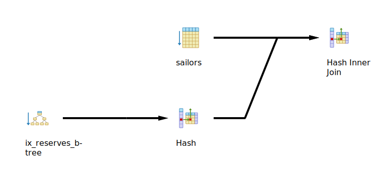
|Run 1|Run 2|Run 3|Average|Planning|Cost|Cost vs w/o Indexes|Time vs w/o Indexes|
|---|---|---|---|---|---|---|---|
|2.068ms|1.967ms|1.933ms|1.989ms|0.192ms|428.39|41%|55%|
#### **Improved SQL** 


We couldn't optimize this query in terms of performance, but the inner join may be more readable.
        It's worth noting that inner join in this query doesn't affect the result vs using `in` keyword 
        because the `reserves` table has a primary key on `bid` and `sid`.

***We recommend creating B-Tree indices on `sailors` and `reserves` tables as indicated in the create index statements below.***
        

```SQL
select s.sname
    from sailors s
    inner join reserves r on r.sid = s.sid where r.bid = 103
    
```
#### **Without Any Optimization** 
Query returns 705 records

](./images/query_7_improved_no_optimization.svg)
|Run 1|Run 2|Run 3|Average|Planning|Cost|Cost vs Unoptimized|Time vs Unoptimized|
|---|---|---|---|---|---|---|---|
|3.383ms|3.057ms|3.044ms|3.161ms|0.131ms|1035.12|100%|87%|
#### **With B-TREE indices**

```SQL
create index "ix_sailors_btree" on "sailors" using btree ("sid");
create index "ix_reserves_btree" on "reserves" using btree ("bid");

```

|Run 1|Run 2|Run 3|Average|Planning|Cost|Cost vs w/o Indexes|Time vs w/o Indexes|Cost vs Unoptimized|Time vs Unoptimized|
|---|---|---|---|---|---|---|---|---|---|
|2.692ms|2.128ms|1.97ms|2.263ms|0.173ms|616.2|60%|72%|100%|107%|
#### **With Hash indices**

```SQL
create index "ix_sailors_hash" on "sailors" using hash ("sid");
create index "ix_reserves_hash" on "reserves" using hash ("bid");

```
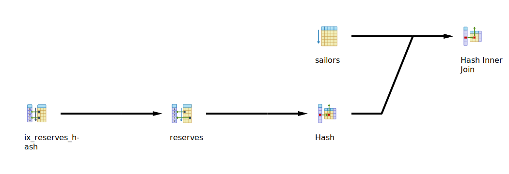
|Run 1|Run 2|Run 3|Average|Planning|Cost|Cost vs w/o Indexes|Time vs w/o Indexes|Cost vs Unoptimized|Time vs Unoptimized|
|---|---|---|---|---|---|---|---|---|---|
|2.332ms|2.169ms|1.885ms|2.129ms|0.118ms|624.83|60%|67%|100%|104%|
#### **With BRIN indices**

```SQL
create index "ix_sailors_brin" on "sailors" using brin ("sid");
create index "ix_reserves_brin" on "reserves" using brin ("bid");

```
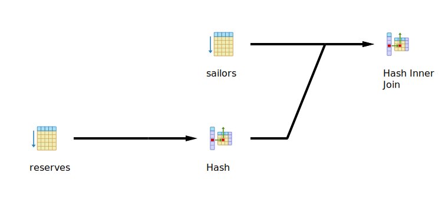
|Run 1|Run 2|Run 3|Average|Planning|Cost|Cost vs w/o Indexes|Time vs w/o Indexes|Cost vs Unoptimized|Time vs Unoptimized|
|---|---|---|---|---|---|---|---|---|---|
|3.541ms|3.086ms|3.292ms|3.306ms|0.168ms|1035.3|100%|105%|100%|99%|
#### **With Mixed indices**

```SQL
create index "ix_sailors_hash" on "sailors" using hash ("sid");
create index "ix_reserves_btree" on "reserves" using btree ("bid") include ("sid") ;

```

|Run 1|Run 2|Run 3|Average|Planning|Cost|Cost vs w/o Indexes|Time vs w/o Indexes|Cost vs Unoptimized|Time vs Unoptimized|
|---|---|---|---|---|---|---|---|---|---|
|2.179ms|1.98ms|1.93ms|2.03ms|0.169ms|428.15|41%|64%|100%|102%|
### Query 8


Find the names of sailors who have reserved a red boat.

```SQL
select s.sname
    from sailors s
            where s.sid in ( select r.sid
            from reserves r
            where r. bid in (select b.bid
                from boat b
                where b.color = 'red'));
```
#### **Without Any Optimization** 
Query returns 3093 records

](./images/query_8_no_optimization.svg)
|Run 1|Run 2|Run 3|Average|Planning|Cost|
|---|---|---|---|---|---|
|5.864ms|5.956ms|6.262ms|6.027ms|0.221ms|1192.95|
#### **With B-TREE indices**

```SQL
create index "ix_sailors_btree" on "sailors" using btree ("sid") include ("sname") ;
create index "ix_reserves_btree" on "reserves" using btree ("sid") include ("bid") ;
create index "ix_boat_btree" on "boat" using btree ("color") include ("bid") ;

```

|Run 1|Run 2|Run 3|Average|Planning|Cost|Cost vs w/o Indexes|Time vs w/o Indexes|
|---|---|---|---|---|---|---|---|
|5.511ms|6.112ms|5.859ms|5.827ms|0.236ms|1143.98|96%|97%|
#### **With Hash indices**

```SQL
create index "ix_sailors_hash" on "sailors" using hash ("sid");
create index "ix_reserves_hash" on "reserves" using hash ("bid");
create index "ix_boat_hash" on "boat" using hash ("color");

```
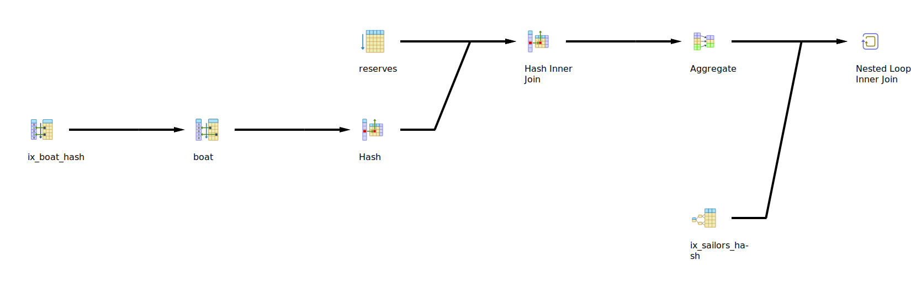
|Run 1|Run 2|Run 3|Average|Planning|Cost|Cost vs w/o Indexes|Time vs w/o Indexes|
|---|---|---|---|---|---|---|---|
|7.137ms|6.372ms|5.974ms|6.494ms|0.26ms|951.94|80%|108%|
#### **With BRIN indices**

```SQL
create index "ix_sailors_brin" on "sailors" using brin ("sid");
create index "ix_reserves_brin" on "reserves" using brin ("bid");
create index "ix_boat_brin" on "boat" using brin ("color");

```
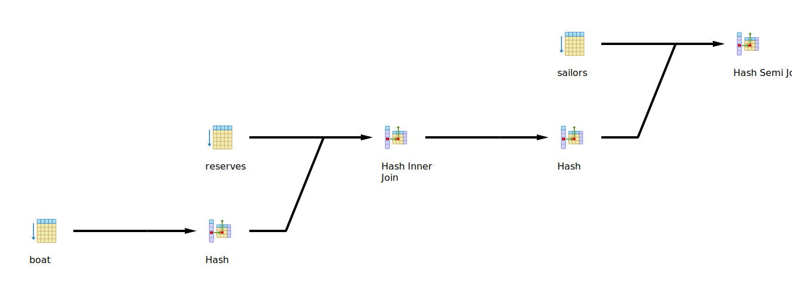
|Run 1|Run 2|Run 3|Average|Planning|Cost|Cost vs w/o Indexes|Time vs w/o Indexes|
|---|---|---|---|---|---|---|---|
|6.828ms|6.155ms|5.782ms|6.255ms|0.196ms|1192.95|100%|104%|
#### **With Mixed indices**

```SQL
create index "ix_sailors_brin" on "sailors" using brin ("sid");
create index "ix_reserves_hash" on "reserves" using hash ("bid");
create index "ix_boat_btree" on "boat" using btree ("color") include ("bid") ;

```
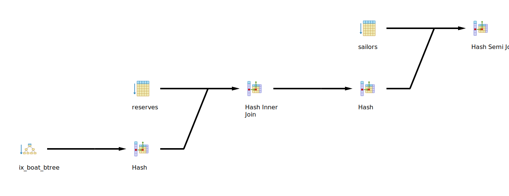
|Run 1|Run 2|Run 3|Average|Planning|Cost|Cost vs w/o Indexes|Time vs w/o Indexes|
|---|---|---|---|---|---|---|---|
|5.877ms|5.992ms|5.491ms|5.787ms|0.269ms|1143.98|96%|96%|
#### **Improved SQL** 


We could not find a query with better performance, 
        but the improved query has better readablity because it has less nested queries.
        
***We recommend creating B-Tree indices on `boat`, `sailors` and `reserves` tables as indicated in the create index statements below.***
        

```SQL
select s.sname from sailors s 
    inner join reserves r on r.sid = s.sid
    inner join boat b on r.bid = b.bid
    where b.color = 'red'
```
#### **Without Any Optimization** 
Query returns 3377 records

](./images/query_8_improved_no_optimization.svg)
|Run 1|Run 2|Run 3|Average|Planning|Cost|Cost vs Unoptimized|Time vs Unoptimized|
|---|---|---|---|---|---|---|---|
|6.321ms|5.578ms|6.441ms|6.113ms|0.279ms|1268.51|106%|101%|
#### **With B-TREE indices**

```SQL
create index "ix_sailors_btree" on "sailors" using btree ("sid") include ("sname") ;
create index "ix_reserves_btree" on "reserves" using btree ("sid") include ("bid") ;
create index "ix_boat_btree" on "boat" using btree ("color") include ("bid") ;

```
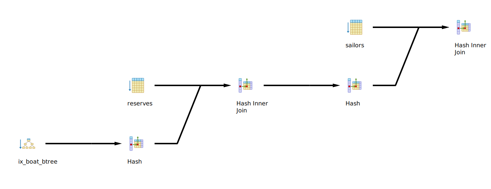
|Run 1|Run 2|Run 3|Average|Planning|Cost|Cost vs w/o Indexes|Time vs w/o Indexes|Cost vs Unoptimized|Time vs Unoptimized|
|---|---|---|---|---|---|---|---|---|---|
|6.146ms|6.117ms|6.768ms|6.344ms|0.324ms|1219.54|96%|104%|107%|109%|
#### **With Hash indices**

```SQL
create index "ix_sailors_hash" on "sailors" using hash ("sid");
create index "ix_reserves_hash" on "reserves" using hash ("bid");
create index "ix_boat_hash" on "boat" using hash ("color");

```

|Run 1|Run 2|Run 3|Average|Planning|Cost|Cost vs w/o Indexes|Time vs w/o Indexes|Cost vs Unoptimized|Time vs Unoptimized|
|---|---|---|---|---|---|---|---|---|---|
|5.998ms|6.51ms|5.771ms|6.093ms|0.279ms|826.08|65%|100%|87%|94%|
#### **With BRIN indices**

```SQL
create index "ix_sailors_brin" on "sailors" using brin ("sid");
create index "ix_reserves_brin" on "reserves" using brin ("bid");
create index "ix_boat_brin" on "boat" using brin ("color");

```

|Run 1|Run 2|Run 3|Average|Planning|Cost|Cost vs w/o Indexes|Time vs w/o Indexes|Cost vs Unoptimized|Time vs Unoptimized|
|---|---|---|---|---|---|---|---|---|---|
|6.182ms|5.836ms|6.172ms|6.063ms|0.274ms|1244.76|98%|99%|104%|97%|
#### **With Mixed indices**

```SQL
create index "ix_sailors_brin" on "sailors" using brin ("sid");
create index "ix_reserves_hash" on "reserves" using hash ("bid");
create index "ix_boat_btree" on "boat" using btree ("color") include ("bid") ;

```

|Run 1|Run 2|Run 3|Average|Planning|Cost|Cost vs w/o Indexes|Time vs w/o Indexes|Cost vs Unoptimized|Time vs Unoptimized|
|---|---|---|---|---|---|---|---|---|---|
|5.661ms|5.681ms|5.814ms|5.719ms|0.277ms|1219.54|96%|94%|107%|99%|
### Query 9


Find the names of sailors who have reserved both a red and a green boat.

```SQL
select s.sname
        from sailors s, reserves r, boat b
            where s.sid = r.sid
            and
            r.bid = b.bid
            and
            b.color = 'red'
            and
            s.sid in ( select s2.sid from sailors s2, boat b2, reserves r2  where s2.sid = r2.sid
                and r2.bid = b2.bid
                and b2.color = 'green');
        
```
#### **Without Any Optimization** 
Query returns 539 records

](./images/query_9_no_optimization.svg)
|Run 1|Run 2|Run 3|Average|Planning|Cost|
|---|---|---|---|---|---|
|11.433ms|10.819ms|10.187ms|10.813ms|0.682ms|2286.27|
#### **With B-TREE indices**

```SQL
create index "ix_sailors_btree" on "sailors" using btree ("sid") include ("sname") ;
create index "ix_reserves_btree" on "reserves" using btree ("bid") include ("sid") ;
create index "ix_boat_btree" on "boat" using btree ("color") include ("bid") ;

```

|Run 1|Run 2|Run 3|Average|Planning|Cost|Cost vs w/o Indexes|Time vs w/o Indexes|
|---|---|---|---|---|---|---|---|
|6.189ms|5.644ms|5.054ms|5.629ms|0.785ms|2065.73|90%|52%|
#### **With Hash indices**

```SQL
create index "ix_sailors_hash" on "sailors" using hash ("sid");
create index "ix_reserves_hash" on "reserves" using hash ("bid");
create index "ix_boat_hash" on "boat" using hash ("color");

```
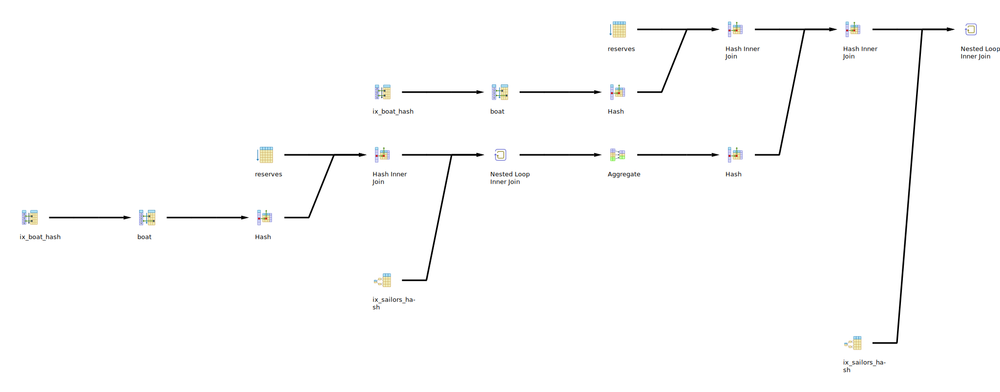
|Run 1|Run 2|Run 3|Average|Planning|Cost|Cost vs w/o Indexes|Time vs w/o Indexes|
|---|---|---|---|---|---|---|---|
|11.818ms|11.018ms|10.404ms|11.08ms|0.788ms|1635.87|72%|102%|
#### **With BRIN indices**

```SQL
create index "ix_sailors_brin" on "sailors" using brin ("sid");
create index "ix_reserves_brin" on "reserves" using brin ("bid");
create index "ix_boat_brin" on "boat" using brin ("color");

```
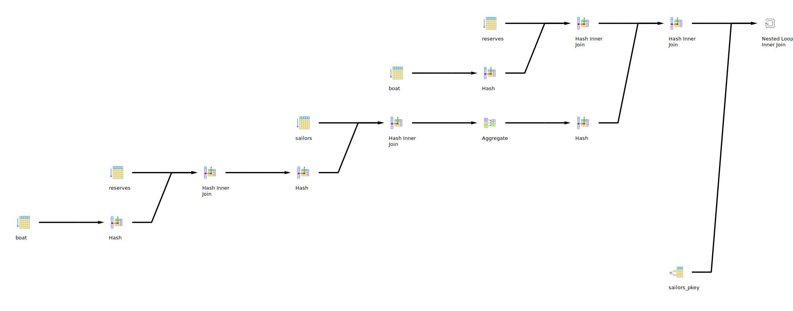
|Run 1|Run 2|Run 3|Average|Planning|Cost|Cost vs w/o Indexes|Time vs w/o Indexes|
|---|---|---|---|---|---|---|---|
|12.169ms|10.694ms|10.808ms|11.224ms|0.731ms|2286.27|100%|104%|
#### **With Mixed indices**

```SQL
create index "ix_sailors_btree" on "sailors" using btree ("sid");
create index "ix_reserves_btree" on "reserves" using btree ("bid") include ("sid") ;
create index "ix_boat_btree" on "boat" using btree ("color") include ("bid") ;

```
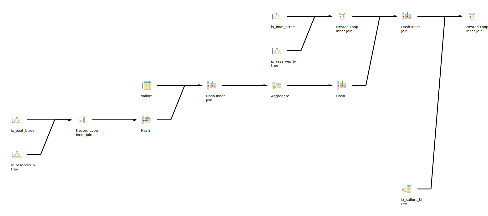
|Run 1|Run 2|Run 3|Average|Planning|Cost|Cost vs w/o Indexes|Time vs w/o Indexes|
|---|---|---|---|---|---|---|---|
|5.915ms|5.254ms|5.825ms|5.665ms|0.815ms|2072.81|91%|52%|
#### **Improved SQL** 


Using CTEs not only made the query more readable, 
        but also caused a small improvement in cost and time of the query.
        
***We recommend creating B-Tree indices on `boat`, `sailors` and `reserves` tables as indicated in the create index statements below.***
        

```SQL
with bgreen as (select bid from boat where color = 'green'),
        bred as (select bid from boat where color = 'red'),
        rgreen as (select sid from reserves where bid in (select bid from bgreen)),
        rred as (select sid from reserves where bid in (select bid from bred))
        select sname from sailors where sid in (select sid from rgreen intersect select sid from rred)
        
```
#### **Without Any Optimization** 
Query returns 490 records

](./images/query_9_improved_no_optimization.svg)
|Run 1|Run 2|Run 3|Average|Planning|Cost|Cost vs Unoptimized|Time vs Unoptimized|
|---|---|---|---|---|---|---|---|
|9.852ms|9.333ms|9.144ms|9.443ms|0.224ms|1996.65|87%|87%|
#### **With B-TREE indices**

```SQL
create index "ix_sailors_btree" on "sailors" using btree ("sid") include ("sname") ;
create index "ix_reserves_btree" on "reserves" using btree ("bid") include ("sid") ;
create index "ix_boat_btree" on "boat" using btree ("color") include ("bid") ;

```

|Run 1|Run 2|Run 3|Average|Planning|Cost|Cost vs w/o Indexes|Time vs w/o Indexes|Cost vs Unoptimized|Time vs Unoptimized|
|---|---|---|---|---|---|---|---|---|---|
|4.178ms|4.333ms|4.305ms|4.272ms|0.383ms|1783.2|89%|45%|86%|76%|
#### **With Hash indices**

```SQL
create index "ix_sailors_hash" on "sailors" using hash ("sid");
create index "ix_reserves_hash" on "reserves" using hash ("bid");
create index "ix_boat_hash" on "boat" using hash ("color");

```

|Run 1|Run 2|Run 3|Average|Planning|Cost|Cost vs w/o Indexes|Time vs w/o Indexes|Cost vs Unoptimized|Time vs Unoptimized|
|---|---|---|---|---|---|---|---|---|---|
|9.598ms|8.895ms|9.168ms|9.22ms|0.263ms|1949.8|98%|98%|119%|83%|
#### **With BRIN indices**

```SQL
create index "ix_sailors_brin" on "sailors" using brin ("sid");
create index "ix_reserves_brin" on "reserves" using brin ("bid");
create index "ix_boat_brin" on "boat" using brin ("color");

```

|Run 1|Run 2|Run 3|Average|Planning|Cost|Cost vs w/o Indexes|Time vs w/o Indexes|Cost vs Unoptimized|Time vs Unoptimized|
|---|---|---|---|---|---|---|---|---|---|
|10.596ms|9.751ms|10.165ms|10.171ms|0.311ms|1996.65|100%|108%|87%|91%|
#### **With Mixed indices**

```SQL
create index "ix_sailors_btree" on "sailors" using btree ("sid");
create index "ix_reserves_btree" on "reserves" using btree ("bid") include ("sid") ;
create index "ix_boat_btree" on "boat" using btree ("color") include ("bid") ;

```
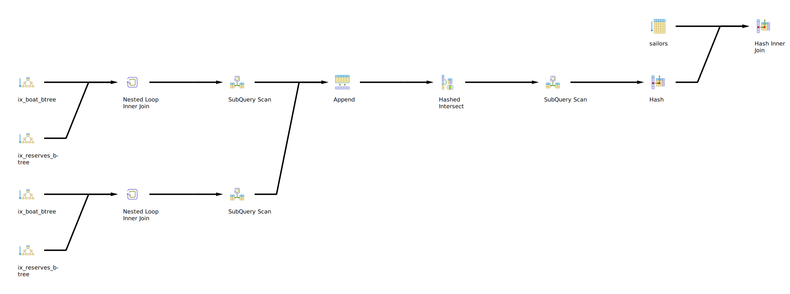
|Run 1|Run 2|Run 3|Average|Planning|Cost|Cost vs w/o Indexes|Time vs w/o Indexes|Cost vs Unoptimized|Time vs Unoptimized|
|---|---|---|---|---|---|---|---|---|---|
|4.154ms|4.321ms|3.923ms|4.133ms|0.307ms|1783.2|89%|44%|86%|73%|

## Schema 4

### Query 10


List all the information of the actors who played a role in the movie 'Annie Hall'.

```SQL
select * 
        from actor 
            where act_id in ( 
                select act_id 
                    from movie_cast 
                    where mov_id in( 
                        select mov_id 
                        from movie 
                        where mov_title ='Annie Hall'
                    )
            )
        
```
#### **Without Any Optimization** 
Query returns 374 records

](./images/query_10_no_optimization.svg)
|Run 1|Run 2|Run 3|Average|Planning|Cost|
|---|---|---|---|---|---|
|34.609ms|30.28ms|29.901ms|31.597ms|0.2ms|3503.52|
#### **With B-TREE indices**

```SQL
create index "ix_movie_cast_btree" on "movie_cast" using btree ("mov_id") include ("act_id") ;
create index "ix_movie_btree" on "movie" using btree ("mov_title") include ("mov_id") ;
create index "ix_actor_btree" on "actor" using btree ("act_id");

```

|Run 1|Run 2|Run 3|Average|Planning|Cost|Cost vs w/o Indexes|Time vs w/o Indexes|
|---|---|---|---|---|---|---|---|
|0.574ms|0.662ms|0.681ms|0.639ms|0.268ms|46.44|1%|2%|
#### **With Hash indices**

```SQL
create index "ix_movie_cast_hash" on "movie_cast" using hash ("mov_id");
create index "ix_movie_hash" on "movie" using hash ("mov_title");
create index "ix_actor_hash" on "actor" using hash ("act_id");

```
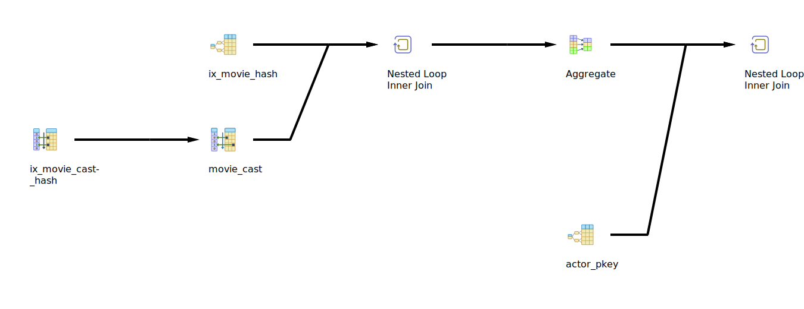
|Run 1|Run 2|Run 3|Average|Planning|Cost|Cost vs w/o Indexes|Time vs w/o Indexes|
|---|---|---|---|---|---|---|---|
|0.683ms|0.583ms|0.603ms|0.623ms|0.216ms|766.47|22%|2%|
#### **With BRIN indices**

```SQL
create index "ix_movie_cast_brin" on "movie_cast" using brin ("mov_id");
create index "ix_movie_brin" on "movie" using brin ("mov_title");
create index "ix_actor_brin" on "actor" using brin ("act_id");

```
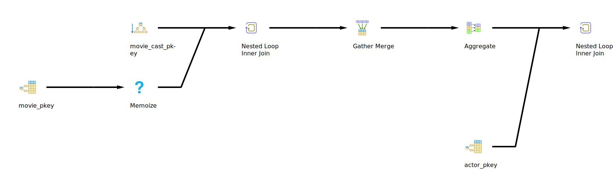
|Run 1|Run 2|Run 3|Average|Planning|Cost|Cost vs w/o Indexes|Time vs w/o Indexes|
|---|---|---|---|---|---|---|---|
|33.628ms|29.69ms|29.976ms|31.098ms|0.32ms|3503.51|100%|98%|
#### **With Mixed indices**

```SQL
create index "ix_movie_cast_hash" on "movie_cast" using hash ("mov_id");
create index "ix_movie_hash" on "movie" using hash ("mov_title");
create index "ix_actor_btree" on "actor" using btree ("act_id");

```

|Run 1|Run 2|Run 3|Average|Planning|Cost|Cost vs w/o Indexes|Time vs w/o Indexes|
|---|---|---|---|---|---|---|---|
|0.666ms|0.665ms|0.575ms|0.635ms|0.171ms|766.45|22%|2%|
#### **Improved SQL** 


The improved query used simple inner joins 
        which made the query plan simpler in case of using no indexes even though the cost is similar.
        However, when using B-Tree indices, the cost and the execution time of the improved query are lower.
        The use of inner joins is possible for this query because `movie_cast` 
        table has a primary key on both `act_id` and `mov_id` columns, so the output of the query won't change vs 
        using `in` keyword.

***We recommend creating B-Tree indices on `movie_cast`, `movie_` and `actor` tables as indicated in the create index statements below.***
        

```SQL
select a.* 
    from actor a
    inner join movie_cast mc on mc.act_id = a.act_id
    inner join movie m on m.mov_id = mc.mov_id
    where m.mov_title = 'Annie Hall'            
        
```
#### **Without Any Optimization** 
Query returns 374 records

](./images/query_10_improved_no_optimization.svg)
|Run 1|Run 2|Run 3|Average|Planning|Cost|Cost vs Unoptimized|Time vs Unoptimized|
|---|---|---|---|---|---|---|---|
|26.338ms|21.758ms|23.94ms|24.012ms|0.268ms|3499.48|100%|76%|
#### **With B-TREE indices**

```SQL
create index "ix_movie_cast_btree" on "movie_cast" using btree ("mov_id") include ("act_id") ;
create index "ix_movie_btree" on "movie" using btree ("mov_title") include ("mov_id") ;
create index "ix_actor_btree" on "actor" using btree ("act_id");

```

|Run 1|Run 2|Run 3|Average|Planning|Cost|Cost vs w/o Indexes|Time vs w/o Indexes|Cost vs Unoptimized|Time vs Unoptimized|
|---|---|---|---|---|---|---|---|---|---|
|0.48ms|0.567ms|0.362ms|0.47ms|0.295ms|42.41|1%|2%|91%|74%|
#### **With Hash indices**

```SQL
create index "ix_movie_cast_hash" on "movie_cast" using hash ("mov_id");
create index "ix_movie_hash" on "movie" using hash ("mov_title");
create index "ix_actor_hash" on "actor" using hash ("act_id");

```
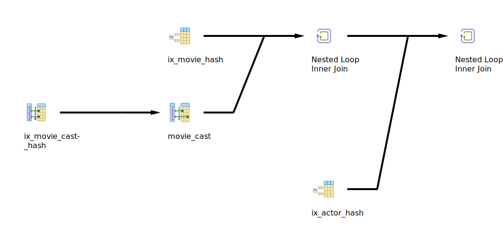
|Run 1|Run 2|Run 3|Average|Planning|Cost|Cost vs w/o Indexes|Time vs w/o Indexes|Cost vs Unoptimized|Time vs Unoptimized|
|---|---|---|---|---|---|---|---|---|---|
|0.892ms|0.817ms|0.782ms|0.83ms|0.264ms|762.18|22%|3%|99%|133%|
#### **With BRIN indices**

```SQL
create index "ix_movie_cast_brin" on "movie_cast" using brin ("mov_id");
create index "ix_movie_brin" on "movie" using brin ("mov_title");
create index "ix_actor_brin" on "actor" using brin ("act_id");

```
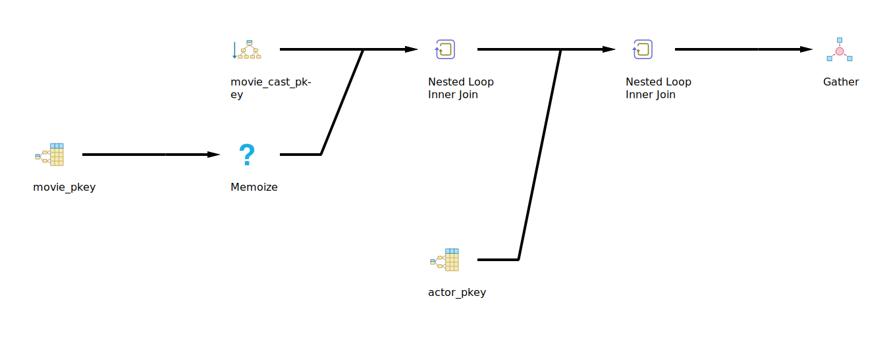
|Run 1|Run 2|Run 3|Average|Planning|Cost|Cost vs w/o Indexes|Time vs w/o Indexes|Cost vs Unoptimized|Time vs Unoptimized|
|---|---|---|---|---|---|---|---|---|---|
|25.339ms|25.844ms|22.012ms|24.398ms|0.248ms|3499.48|100%|102%|100%|78%|
#### **With Mixed indices**

```SQL
create index "ix_movie_cast_hash" on "movie_cast" using hash ("mov_id");
create index "ix_movie_hash" on "movie" using hash ("mov_title");
create index "ix_actor_btree" on "actor" using btree ("act_id");

```

|Run 1|Run 2|Run 3|Average|Planning|Cost|Cost vs w/o Indexes|Time vs w/o Indexes|Cost vs Unoptimized|Time vs Unoptimized|
|---|---|---|---|---|---|---|---|---|---|
|0.744ms|0.611ms|0.534ms|0.63ms|0.31ms|762.47|22%|3%|99%|99%|
### Query 11


Find the name of the director (first and last names) who directed a movie that casted a role for 
        'Eyes Wide Shut'

```SQL
select dir_fname, dir_lname 
    from director 
    where dir_id in( 
        select dir_id 
            from movie_direction 
            where mov_id in( 
                select mov_id 
                    from movie_cast 
                    where role =any(
                        select role 
                            from movie_cast 
                            where mov_id in( 
                                select mov_id 
                                    from movie 
                                    where mov_title='Eyes Wide Shut'
                                )
                        )
                )
            )
        
```
#### **Without Any Optimization** 
Query returns 5 records

](./images/query_11_no_optimization.svg)
|Run 1|Run 2|Run 3|Average|Planning|Cost|
|---|---|---|---|---|---|
|24.917ms|24.285ms|27.245ms|25.482ms|0.401ms|5400.02|
#### **With B-TREE indices**

```SQL
create index "ix_movie_direction_btree" on "movie_direction" using btree ("mov_id");
create index "ix_movie_cast_btree" on "movie_cast" using btree ("mov_id") include ("role") ;
create index "ix_movie_cast_btree2" on "movie_cast" using btree ("role") include ("mov_id") ;
create index "ix_movie_btree" on "movie" using btree ("mov_title") include ("mov_id") ;
create index "ix_director_btree" on "director" using btree ("dir_id");

```

|Run 1|Run 2|Run 3|Average|Planning|Cost|Cost vs w/o Indexes|Time vs w/o Indexes|
|---|---|---|---|---|---|---|---|
|0.871ms|0.825ms|0.792ms|0.829ms|0.542ms|146.16|3%|3%|
#### **With Hash indices**

```SQL
create index "ix_movie_direction_hash" on "movie_direction" using hash ("mov_id");
create index "ix_movie_cast_hash" on "movie_cast" using hash ("mov_id");
create index "ix_movie_hash" on "movie" using hash ("mov_title");
create index "ix_director_hash" on "director" using hash ("dir_id");

```
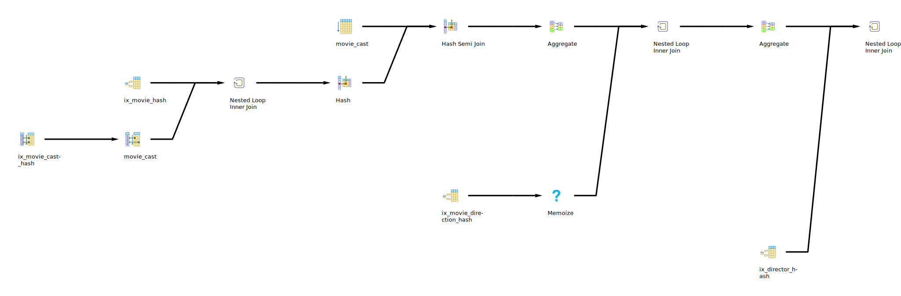
|Run 1|Run 2|Run 3|Average|Planning|Cost|Cost vs w/o Indexes|Time vs w/o Indexes|
|---|---|---|---|---|---|---|---|
|8.183ms|9.489ms|8.35ms|8.674ms|0.501ms|2515.91|47%|34%|
#### **With BRIN indices**

```SQL
create index "ix_movie_direction_brin" on "movie_direction" using brin ("mov_id");
create index "ix_movie_cast_brin" on "movie_cast" using brin ("mov_id");
create index "ix_movie_brin" on "movie" using brin ("mov_title");
create index "ix_director_brin" on "director" using brin ("dir_id");

```

|Run 1|Run 2|Run 3|Average|Planning|Cost|Cost vs w/o Indexes|Time vs w/o Indexes|
|---|---|---|---|---|---|---|---|
|25.089ms|24.547ms|24.23ms|24.622ms|0.45ms|5400.02|100%|97%|
#### **With Mixed indices**

```SQL
create index "ix_movie_direction_btree" on "movie_direction" using btree ("mov_id");
create index "ix_movie_cast_btree" on "movie_cast" using btree ("mov_id") include ("role") ;
create index "ix_movie_cast_btree2" on "movie_cast" using btree ("role") include ("mov_id") ;
create index "ix_movie_hash" on "movie" using hash ("mov_title");
create index "ix_director_hash" on "director" using hash ("dir_id");

```
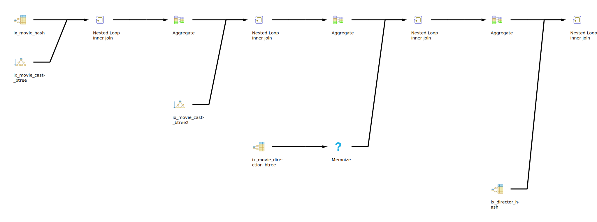
|Run 1|Run 2|Run 3|Average|Planning|Cost|Cost vs w/o Indexes|Time vs w/o Indexes|
|---|---|---|---|---|---|---|---|
|0.868ms|0.782ms|0.892ms|0.847ms|0.508ms|120.26|2%|3%|
#### **Improved SQL** 


THE CTE and the joins made the improved query more readable, 
        and a small reduction of the query cost and time when using B-Tree indices 
        since there 2 more aggregate steps in the original query's plan.
        
***We recommend creating B-Tree indices on `movie_cast`, `movie`, `movie_direction` and `director` tables as indicated in the create index statements below.***
        

```SQL
WITH movs as (select mc2.mov_id from
            movie m
            inner join movie_cast mc
            on m.mov_id = mc.mov_id 
            inner join movie_cast mc2 on mc2.role = mc.role
            where mov_title = 'Eyes Wide Shut'
            )
        select dir_fname, dir_lname
    from director d
    inner join movie_direction md 
    on md.dir_id = d.dir_id
    where mov_id in (select mov_id from movs)
```
#### **Without Any Optimization** 
Query returns 5 records

](./images/query_11_improved_no_optimization.svg)
|Run 1|Run 2|Run 3|Average|Planning|Cost|Cost vs Unoptimized|Time vs Unoptimized|
|---|---|---|---|---|---|---|---|
|25.026ms|25.526ms|25.819ms|25.457ms|0.465ms|5488.58|102%|100%|
#### **With B-TREE indices**

```SQL
create index "ix_movie_direction_btree" on "movie_direction" using btree ("mov_id");
create index "ix_movie_cast_btree" on "movie_cast" using btree ("mov_id") include ("role") ;
create index "ix_movie_cast_btree2" on "movie_cast" using btree ("role") include ("mov_id") ;
create index "ix_movie_btree" on "movie" using btree ("mov_title") include ("mov_id") ;
create index "ix_director_btree" on "director" using btree ("dir_id");

```

|Run 1|Run 2|Run 3|Average|Planning|Cost|Cost vs w/o Indexes|Time vs w/o Indexes|Cost vs Unoptimized|Time vs Unoptimized|
|---|---|---|---|---|---|---|---|---|---|
|0.848ms|0.781ms|0.783ms|0.804ms|0.601ms|136.42|2%|3%|93%|97%|
#### **With Hash indices**

```SQL
create index "ix_movie_direction_hash" on "movie_direction" using hash ("mov_id");
create index "ix_movie_cast_hash" on "movie_cast" using hash ("mov_id");
create index "ix_movie_hash" on "movie" using hash ("mov_title");
create index "ix_director_hash" on "director" using hash ("dir_id");

```
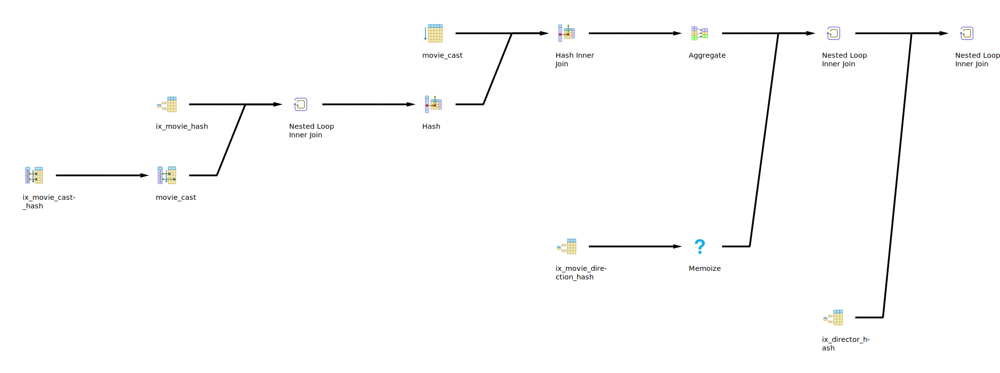
|Run 1|Run 2|Run 3|Average|Planning|Cost|Cost vs w/o Indexes|Time vs w/o Indexes|Cost vs Unoptimized|Time vs Unoptimized|
|---|---|---|---|---|---|---|---|---|---|
|8.405ms|8.499ms|8.313ms|8.406ms|0.516ms|2604.4|47%|33%|104%|97%|
#### **With BRIN indices**

```SQL
create index "ix_movie_direction_brin" on "movie_direction" using brin ("mov_id");
create index "ix_movie_cast_brin" on "movie_cast" using brin ("mov_id");
create index "ix_movie_brin" on "movie" using brin ("mov_title");
create index "ix_director_brin" on "director" using brin ("dir_id");

```
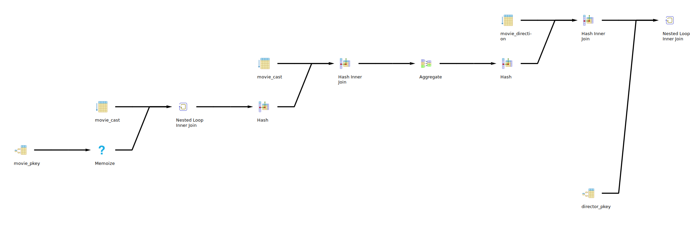
|Run 1|Run 2|Run 3|Average|Planning|Cost|Cost vs w/o Indexes|Time vs w/o Indexes|Cost vs Unoptimized|Time vs Unoptimized|
|---|---|---|---|---|---|---|---|---|---|
|25.082ms|29.228ms|25.203ms|26.504ms|0.501ms|5488.57|100%|104%|102%|108%|
#### **With Mixed indices**

```SQL
create index "ix_movie_direction_btree" on "movie_direction" using btree ("mov_id");
create index "ix_movie_cast_btree" on "movie_cast" using btree ("mov_id") include ("role") ;
create index "ix_movie_cast_btree2" on "movie_cast" using btree ("role") include ("mov_id") ;
create index "ix_movie_hash" on "movie" using hash ("mov_title");
create index "ix_director_hash" on "director" using hash ("dir_id");

```
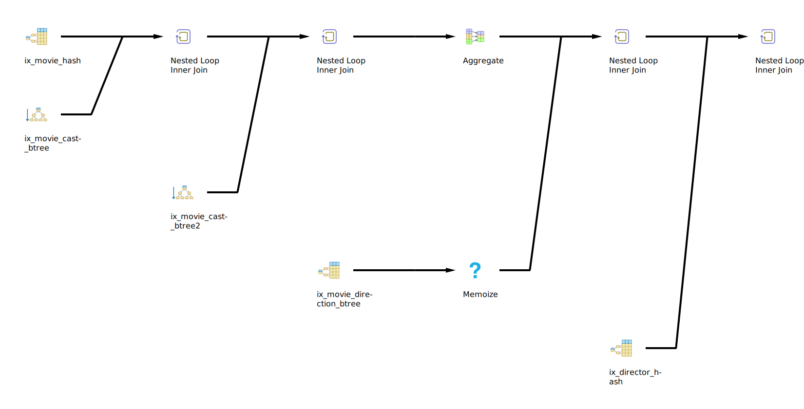
|Run 1|Run 2|Run 3|Average|Planning|Cost|Cost vs w/o Indexes|Time vs w/o Indexes|Cost vs Unoptimized|Time vs Unoptimized|
|---|---|---|---|---|---|---|---|---|---|
|0.81ms|0.774ms|0.745ms|0.776ms|0.65ms|111.45|2%|3%|93%|92%|
### Query 12


Find the titles of all movies directed by the director whose first and last name are Woddy Allen.

```SQL
select mov_title 
    from movie 
    where mov_id in ( 
        select mov_id 
            from movie_direction 
            where dir_id= (select dir_id 
                    from director 
                        where dir_fname='Woddy' and dir_lname='Allen'
                )
            )
        
```
#### **Without Any Optimization** 
Query returns 351 records

](./images/query_12_no_optimization.svg)
|Run 1|Run 2|Run 3|Average|Planning|Cost|
|---|---|---|---|---|---|
|0.67ms|0.624ms|0.641ms|0.645ms|0.134ms|159.61|
#### **With B-TREE indices**

```SQL
create index "ix_movie_direction_btree" on "movie_direction" using btree ("dir_id");
create index "ix_movie_btree" on "movie" using btree ("mov_id") include ("mov_title") ;
create index "ix_director_btree" on "director" using btree ("dir_fname", "dir_lname") include ("dir_id") ;

```

|Run 1|Run 2|Run 3|Average|Planning|Cost|Cost vs w/o Indexes|Time vs w/o Indexes|
|---|---|---|---|---|---|---|---|
|0.341ms|0.328ms|0.33ms|0.333ms|0.163ms|13.04|8%|52%|
#### **With Hash indices**

```SQL
create index "ix_movie_direction_hash" on "movie_direction" using hash ("dir_id");
create index "ix_movie_hash" on "movie" using hash ("mov_id");
create index "ix_director_hash" on "director" using hash ("dir_lname");

```

|Run 1|Run 2|Run 3|Average|Planning|Cost|Cost vs w/o Indexes|Time vs w/o Indexes|
|---|---|---|---|---|---|---|---|
|0.598ms|0.66ms|0.529ms|0.596ms|0.171ms|20.34|13%|92%|
#### **With BRIN indices**

```SQL
create index "ix_movie_direction_brin" on "movie_direction" using brin ("dir_id");
create index "ix_movie_brin" on "movie" using brin ("mov_id");
create index "ix_director_brin" on "director" using brin ("dir_lname");

```
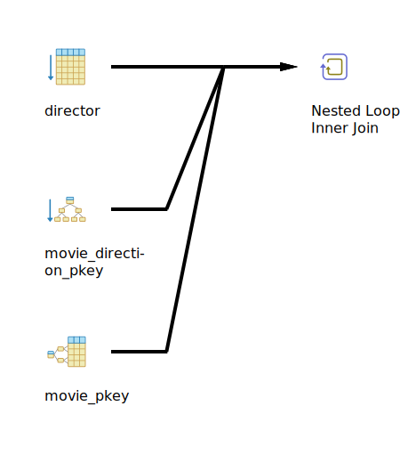
|Run 1|Run 2|Run 3|Average|Planning|Cost|Cost vs w/o Indexes|Time vs w/o Indexes|
|---|---|---|---|---|---|---|---|
|0.641ms|0.629ms|0.628ms|0.633ms|0.133ms|159.61|100%|98%|
#### **With Mixed indices**

```SQL
create index "ix_movie_direction_btree" on "movie_direction" using btree ("mov_id");
create index "ix_movie_hash" on "movie" using hash ("mov_id");
create index "ix_director_btree" on "director" using btree ("dir_fname", "dir_lname") include ("dir_id") ;

```
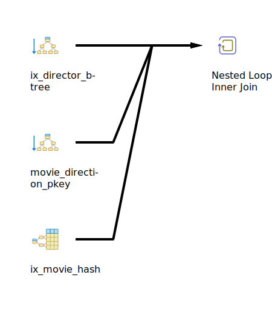
|Run 1|Run 2|Run 3|Average|Planning|Cost|Cost vs w/o Indexes|Time vs w/o Indexes|
|---|---|---|---|---|---|---|---|
|0.638ms|0.579ms|0.293ms|0.503ms|0.144ms|16.62|10%|78%|
#### **Improved SQL** 


The improved query reduced the cost when using B-Tree indices. The execution time is about the same.
        The noticeable different is that in the original query, the engine's plan had one nested loop inner join with 3 tables, 
        while in the improved query case it had 2 nested loop inner joins with 2 tables each.
        
***We recommend creating B-Tree indices on `movie`, `movie_direction` and `director` tables as indicated in the create index statements below.***
        

```SQL
WITH wa as (select dir_id from director where dir_fname='Woddy' and dir_lname='Allen'),
wa_movies as (select mov_id from movie_direction where dir_id in (select dir_id from wa))
select mov_title 
from movie m inner join wa_movies on m.mov_id = wa_movies.mov_id
```
#### **Without Any Optimization** 
Query returns 351 records

](./images/query_12_improved_no_optimization.svg)
|Run 1|Run 2|Run 3|Average|Planning|Cost|Cost vs Unoptimized|Time vs Unoptimized|
|---|---|---|---|---|---|---|---|
|0.666ms|0.67ms|0.642ms|0.659ms|0.191ms|153.09|96%|102%|
#### **With B-TREE indices**

```SQL
create index "ix_movie_direction_btree" on "movie_direction" using btree ("dir_id");
create index "ix_movie_btree" on "movie" using btree ("mov_id") include ("mov_title") ;
create index "ix_director_btree" on "director" using btree ("dir_fname", "dir_lname") include ("dir_id") ;

```

|Run 1|Run 2|Run 3|Average|Planning|Cost|Cost vs w/o Indexes|Time vs w/o Indexes|Cost vs Unoptimized|Time vs Unoptimized|
|---|---|---|---|---|---|---|---|---|---|
|0.329ms|0.331ms|0.328ms|0.329ms|0.237ms|9.67|6%|50%|74%|99%|
#### **With Hash indices**

```SQL
create index "ix_movie_direction_hash" on "movie_direction" using hash ("dir_id");
create index "ix_movie_hash" on "movie" using hash ("mov_id");
create index "ix_director_hash" on "director" using hash ("dir_lname");

```
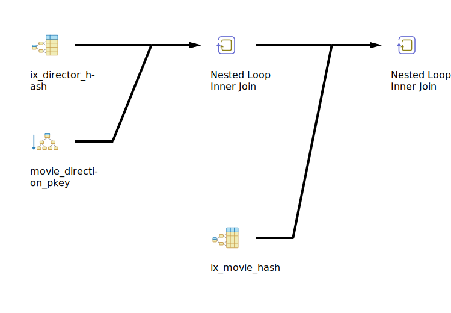
|Run 1|Run 2|Run 3|Average|Planning|Cost|Cost vs w/o Indexes|Time vs w/o Indexes|Cost vs Unoptimized|Time vs Unoptimized|
|---|---|---|---|---|---|---|---|---|---|
|0.567ms|0.61ms|0.413ms|0.53ms|0.249ms|13.97|9%|80%|69%|89%|
#### **With BRIN indices**

```SQL
create index "ix_movie_direction_brin" on "movie_direction" using brin ("dir_id");
create index "ix_movie_brin" on "movie" using brin ("mov_id");
create index "ix_director_brin" on "director" using brin ("dir_lname");

```
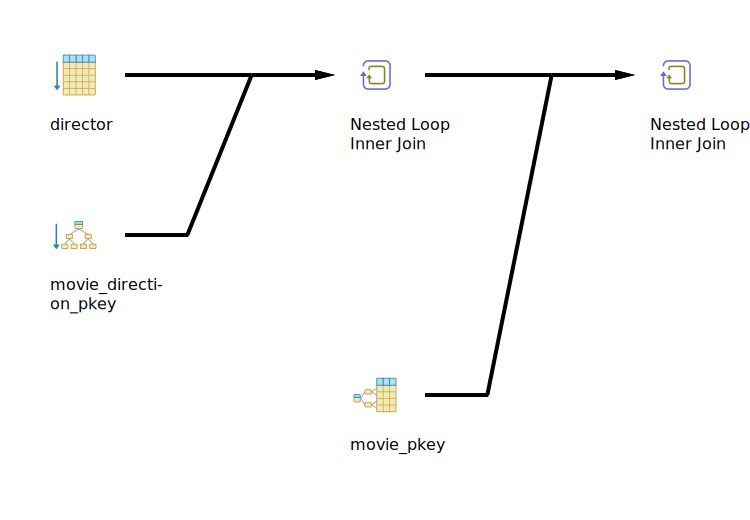
|Run 1|Run 2|Run 3|Average|Planning|Cost|Cost vs w/o Indexes|Time vs w/o Indexes|Cost vs Unoptimized|Time vs Unoptimized|
|---|---|---|---|---|---|---|---|---|---|
|0.723ms|0.645ms|1.087ms|0.818ms|0.257ms|153.09|100%|124%|96%|129%|
#### **With Mixed indices**

```SQL
create index "ix_movie_direction_btree" on "movie_direction" using btree ("mov_id");
create index "ix_movie_hash" on "movie" using hash ("mov_id");
create index "ix_director_btree" on "director" using btree ("dir_fname", "dir_lname") include ("dir_id") ;

```

|Run 1|Run 2|Run 3|Average|Planning|Cost|Cost vs w/o Indexes|Time vs w/o Indexes|Cost vs Unoptimized|Time vs Unoptimized|
|---|---|---|---|---|---|---|---|---|---|
|0.624ms|0.656ms|0.583ms|0.621ms|0.235ms|10.25|7%|94%|62%|123%|

## Conclusion

In all queries the B-Tree index performed better than Hash and BRIN indices. 
B-Tree also had the advantage of supporting an index on multiple columns which is not supported in either Hash or BRIN.
Also B-Tree support `include` clause,  which can improve the performance by including a column with the index, and therefore making the engine skip the step where it has to lookup the value after using the index.

The Hash index did improve the performance of many queries, however the B-Tree index always performed better.

As for the BRIN index, it had no effect whatsoever on most queries.